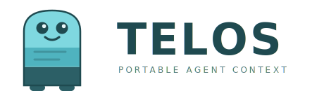
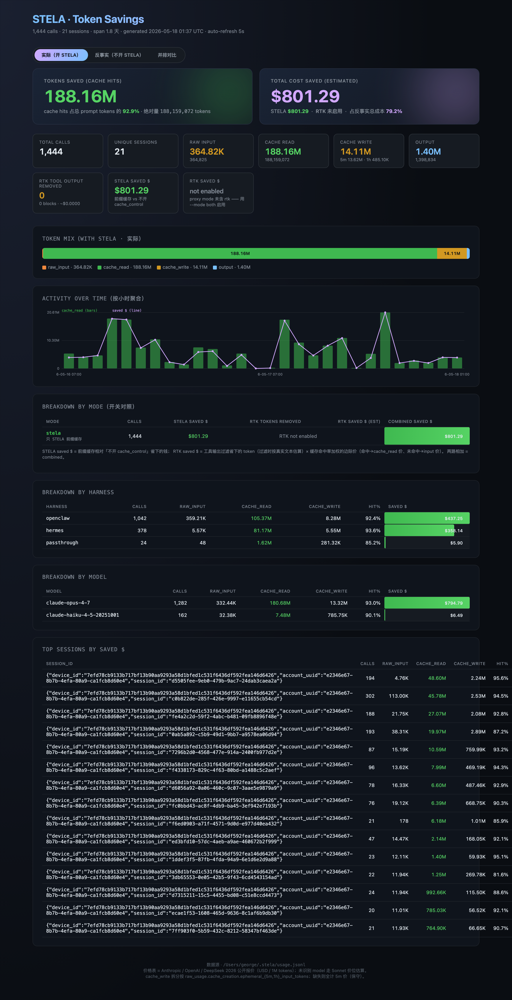

<div align="center">



### A portable, cache-friendly protocol for LLM agent context.

<sub>One canonical IR — your tools, system, turns, and memory — runs unchanged across Anthropic, OpenAI, DeepSeek, vLLM, and SGLang, with KV-cache hits preserved across turns and cost reported in absolute dollars.</sub>

<br/>

[](LICENSE)
[](pyproject.toml)
[](CHANGELOG.md)
[](docs/2026-05-06-telos-protocol.md)

[**Quickstart**](#-30-second-start) · [**Engines**](#-engines--one-ir-five-backends) · [**Why**](#-why-telos-exists--stop-being-a-tenant-in-someone-elses-agent) · [**Three things**](#-one-representation-three-things) · [**Protocol**](docs/2026-05-06-telos-protocol.md) · [**User Guide**](docs/User-guide.md)

<sub>📖 &nbsp;**English** · [Simplified Chinese](README.zh-CN.md)</sub>

</div>

---

## ⬢ &nbsp;30-second start

```python
from telos import Bridge, load_engine, load_harness

harness = load_harness("openclaw")          # or "hermes"
engine  = load_engine("anthropic")          # or "openai" / "deepseek"

ir = harness.parse(raw_request, session_id="task-001",
                   engine="anthropic", model="claude-opus-4-7",
                   expected_turns=20)

bridge = Bridge(ir, engine)
plan   = bridge.mark()        # let the engine decide BP / routing-key
wire   = bridge.emit()        # get the wire request, ready to send

response = call_llm(wire)     # your own HTTP client
report   = bridge.absorb_usage(response)
print(report.cache_read, report.raw_input)
```

Full end-to-end run: [`telos/demo.py`](demo.py) — `python -m telos.demo`.

---

## ⬢ &nbsp;What it looks like

<div align="center">



<sub>Every call's normalized usage lands in a jsonl log, aggregated into a single-file HTML dashboard.<br/>It counts <strong>absolute dollars saved</strong> — not ratios you can game by shrinking the denominator.</sub>

</div>

---

## ⬢ &nbsp;Engines — one IR, five backends

TELOS is normative: it defines how context *should* be represented, and engines align by capability. One `TelosIR` landing on different engines is degraded **deterministically** by the adapter — never silently, never lossily in meaning.

| Capability | Anthropic 4.6+ | OpenAI 4+/5.x | DeepSeek V3+ | vLLM | SGLang |
|---|:---:|:---:|:---:|:---:|:---:|
| explicit BP / anchors | ✓ (≤4) | ✗ | ✗ | ✓ | ✓ |
| explicit prewarm | ✓ | ✗ | ✗ | ✓ | ✓ |
| routing key | ✗ | `prompt_cache_key` | ✗ | `cache_salt` | `affinity_key` |
| cache probe / segment evict | ✗ | ✗ | ✗ | ✓ | ✓ |
| fork-and-replace | ✗ | ✗ | ✗ | partial | ✓ |

> **Bidirectional capability** (`BidirectionalEngineAdapter`, only on open-source inference engines): `cooperative_fold()` lets the server keep the prefix KV untouched and recompute only the summary tail — a closed API's `fold` is a client-side rewrite that forces the server to re-prefill the whole span every time. Full matrix in [protocol §6](docs/2026-05-06-telos-protocol.md).

---

## ⬢ &nbsp;Why TELOS exists — stop being a tenant in someone else's agent

<p align="center">
  <em>Every team putting agents into production hits the same four walls.<br/>
  TELOS is the single answer to all four — one canonical representation of agent context.</em>
</p>

<table>
<tr>
<td width="50%" valign="top">

### 🔒 &nbsp;Context no longer locked to one vendor

> *"Switch models to run the same task, and you start from scratch."*

`TelosIR` is an **engine-agnostic, serializable, portable** representation of context. An Anthropic session moves verbatim to DeepSeek, to your own vLLM — adapters degrade deterministically, without losing meaning.

<sub>📁 [`telos/ir.py`](ir.py) · [`telos/engine/`](engine/)</sub>

</td>
<td width="50%" valign="top">

### 💸 &nbsp;Stop paying twice for the same prefix

> *"Twenty turns in, every turn re-prefills the identical prefix."*

Three-color bands — **PIN · FOLD · DROP** — plus one ordering invariant keep the "base" resident in the KV cache. Memory is pulled on demand, not stuffed whole into every prompt.

<sub>📁 [`telos/bridge.py`](bridge.py) · [`telos/refpool.py`](refpool.py)</sub>

</td>
</tr>
<tr>
<td width="50%" valign="top">

### 🧾 &nbsp;Cost you can see, counted in absolute $

> *"All you get is a ratio, diluted by whatever denominator."*

Every call's normalized usage lands in a jsonl log, aggregated into a single-file HTML dashboard. It counts **absolutes**: cache_read, cost saved — ratios can be gamed by shrinking the denominator; absolute $ cannot.

<sub>📁 [`scripts/build_savings_dashboard.py`](scripts/build_savings_dashboard.py)</sub>

</td>
<td width="50%" valign="top">

### 🎛 &nbsp;You hold the controller

> *"Handing a task to the agent that's better at it — can't be done."*

Because context is portable, you genuinely hold the controller: one task dispatched across harnesses, taking the best of each. **TELOS provides mechanism, never policy** — it never decides for you, never burns an LLM call on routing.

<sub>📁 [`telos/harness/`](harness/)</sub>

</td>
</tr>
</table>

<p align="center">
  <strong>In one sentence:</strong> TELOS is the canonical representation of the only durable asset<br/>
  in the agent stack — context. Your context; harnesses are just hired help.
</p>

---

## ⬢ &nbsp;One representation, three things

**TELOS** — Greek τέλος, "purpose, end"; also read as "stone tablet." The inscription on a tablet's base is carved once and lasts a lifetime; the lines added turn by turn above can be wiped anytime, but never touch the base. And the tablet means a second thing — **the tablet is yours**: it can be carried to any scribe (harness), any printing house (engine).

```
③ Sovereignty   You hold the controller — any task, hire any harness, any model, no cage
                      ▲  made possible only by
① Portability   Context / memory is an engine-agnostic, serializable, portable asset
                      ▼  and the same representation also delivers
② Efficiency    Extreme KV-cache hits + on-demand memory; cost in absolute $, visible
```

> **③ is the purpose, ① the mechanism, ② the payoff and the wedge.** Not parallel — a stack. The iron rule: TELOS provides mechanism, never policy — the moment it decides for you, it has taken the controller back.

---

## ⬢ &nbsp;Architecture

```
agent harness ──► TELOS Bridge ──► engine adapter ──► LLM service
   (parse)          (5 primitives)   (capability-aware)
```

| Layer | Files | Responsibility |
|---|---|---|
| harness | [`harness/openclaw.py`](harness/) `hermes.py` | split envelope, large docs into ref-pool, produce `TelosIR` |
| bridge | [`bridge.py`](bridge.py) [`ir.py`](ir.py) [`refpool.py`](refpool.py) | 5 primitives, invariant checks, frozen ref-pool slugs, canonicalize |
| engine | [`engine/anthropic.py`](engine/) `openai.py` `deepseek.py` | capability-aware Mark, wire serialization, usage parsing |

The bridge is pure Python with no LLM SDK dependency. `TelosIR` is the single data structure that passes between all three layers — frozen, narrow-fielded, engine-agnostic.

---

## ⬢ &nbsp;One invariant

The whole protocol has exactly one hard constraint. Within each segment (`tools` / `system` / a single `message`), blocks must be in physical order:

```
PIN*  →  FOLD*  →  DROP*
```

<sub>(In a `message`, `tool_result` blocks always come first — required by the Anthropic protocol.)</sub>

| Band | Meaning | Typical content |
|---|---|---|
| **PIN** | long-lived stable segment | tool definitions, system prompt, the user's current question |
| **FOLD** | cacheable but droppable on compact | assistant replies, tool_result, large ref-pool docs |
| **DROP** | never enters the cache hash | timestamp, cwd, git status, envelope |

Violate it and `TelosInvariantError` is raised. Everything else is a soft suggestion.

### Five primitives &nbsp;<sub>(`Bridge` methods)</sub>

| Primitive | Purpose |
|---|---|
| `place(segment, blocks)` | put blocks into tools / system / the current message |
| `pin(slug, payload)` | write a PIN block into the system segment |
| `mark()` | let the engine produce this turn's BP / routing-key plan |
| `fold(slugs= / message_range=, summary=)` | fold old turns into ref-pool references |
| `refresh(plan)` | once throttling allows, send a `max_tokens=0` prewarm (Anthropic only) |

### ref-pool — a "pointer table" for context

A slug is **frozen** the moment `register()` is called: content can change (`fold()`), the slug cannot. `fold()` swaps the payload, not the slug → every `[ref:slug]` reference stays byte-identical → BPs still hit after a fold. This is "portable context" realized in the protocol: **stable pointers, flowing content.**

---

## ⬢ &nbsp;Cost you can see · savings dashboard

Every TELOS entry point (gateway / SDK transport) appends each call's normalized usage to a `usage_log` jsonl, aggregated into a single-file HTML page (zero JS, opens offline):

```bash
# one-line install
pip install telos-sdk          # or: brew install telos-sdk (see packaging/)

# auto-detect harnesses, inject config, start the gateway
telos init

# open the live dashboard in your browser
telos dashboard
```

The dashboard counts **absolutes**: cumulative cache_read, cost saved = cache_read × (input_price − cache_read_price), token mix, broken down across harness / model / session.

---

## ⬢ &nbsp;Appendix: R1–R8 protocol-hazard fixes

Review surfaced 8 design hazards in the protocol; the Python implementation fixes all of them:

| ID | Problem | Fix location |
|---|---|---|
| R1 | OpenAI `prompt_cache_key` only widens slots at ≥15 RPM per key | `engine/openai.py :: KEY_RPM_SOFT_CAP = 12` + `shard()` |
| R2 | Anthropic's 4 BPs cover only head + tail, leaving mid turns uncached | `engine/anthropic.py :: _MID_ANCHOR_STRIDE = 19` |
| R3 | sub-agent IR and parent IR sharing a `session_id` | `harness/hermes.py` — sub-IR parsed independently |
| R4 | after `fold()`, a Mark slot can land in a folded span | `bridge.py :: fold()` — re-run `mark()` |
| R5 | tool field / array order not stably canonicalized | `bridge.py :: _canonicalize_ir()` |
| R6 | thinking blocks lost across non-tool_result calls | `engine/base.py :: thinking_preserved_across_non_tool_result` |
| R7 | no explicit priority when Anthropic BP candidates > 4 | `engine/anthropic.py :: plan_marks` priority + truncation |
| R8 | refresh unthrottled, can saturate quota in reverse | `bridge.py :: REFRESH_THRESHOLD = 11` adaptive gate |

---

## ⬢ &nbsp;Going deeper

| What you want | Where |
|---|---|
| Get started (install, integration, CLI, troubleshooting) | [`docs/User-guide.md`](docs/User-guide.md) |
| Understand the protocol | [`docs/2026-05-06-telos-protocol.md`](docs/2026-05-06-telos-protocol.md) |
| See the architecture | [`docs/ARCHITECTURE.md`](docs/ARCHITECTURE.md) |
| See the change history | [`CHANGELOG.md`](CHANGELOG.md) |

---

## ⬢ &nbsp;License

Apache-2.0 — the protocol core is open source, forever. See [LICENSE](LICENSE).
