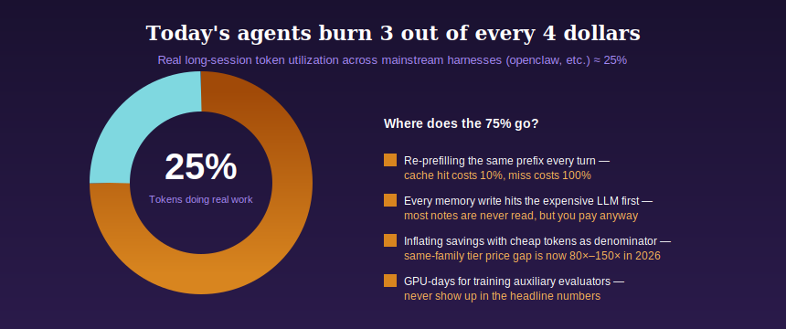
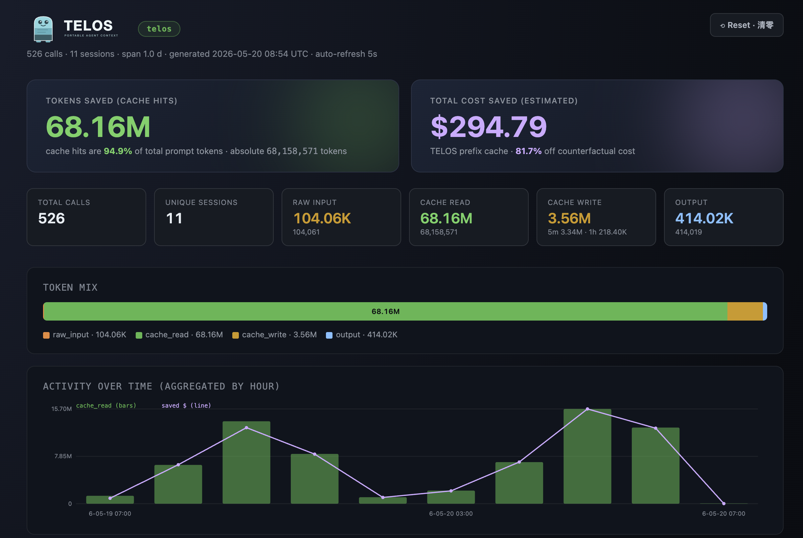
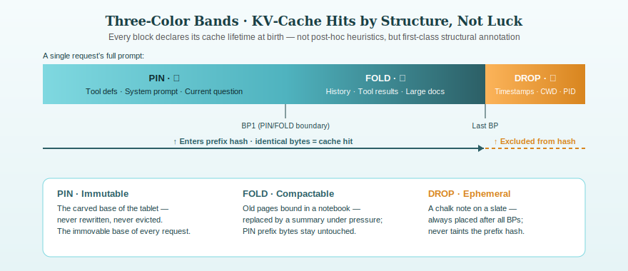
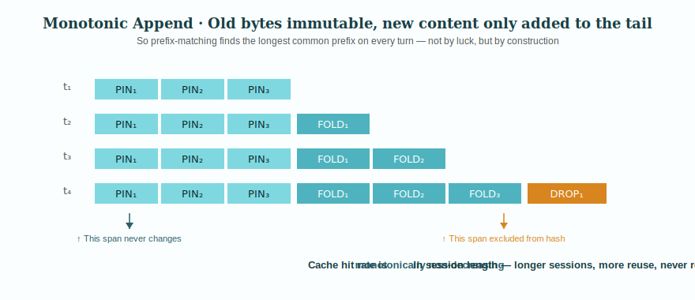

<div align="center">


### 上下文归你所有 · Agent 是雇来的

**无需重写。无需压缩。可节省 90% token 账单。**

<sub>一份唯一 IR——tools、system、turns 与 memory——可在 Anthropic · OpenAI · DeepSeek · vLLM · SGLang 上不加修改地运行<br/>真实 6 轮会话节省 -92.3% · 成本按绝对 $/已解决请求 记录——比例可以造，美元不行</sub>

<sub>清华大学 LEAP Lab —— 聚焦机器学习、多模态学习与具身智能的研究团队 · <a href="https://www.leaplab.ai/">leaplab.ai</a></sub>

<br/>

[](LICENSE)
[](pyproject.toml)
[](CHANGELOG.md)
[](docs/2026-05-06-telos-protocol.md)

[**快速开始**](#quickstart) · [**支持矩阵**](#support-matrix) · [**为什么**](#why-telos) · [**协议**](#protocol) · [**路线图**](#roadmap) · [**引用**](#citation)

<sub>📖 &nbsp;**English** · [简体中文](README.zh-CN.md)</sub>

</div>

---

<a id="problem"></a>

## ⬢ &nbsp;凌晨 2 点：钱到底花到哪里去了？

凌晨 2 点，agent 还在跑。右下角计数器跳到 2,847,103，你换算成美元后心里一沉。更糟的是，上面一行写着 `cache_read: 0`。一整夜里，每一轮都把同一段 4,000-token 的 system prompt 从头喂给模型，按全价计费。

把同一段真实 **6 轮** 会话丢进 openclaw，只改两个开关：

| 模式 | raw input tokens | cache_read | 6 轮总成本 |
|---|:--:|:--:|:--:|
| passthrough（今天的默认） | 24,151 | 0 | **$0.3623** |
| 使用 TELOS | 0 | 18,701 | **$0.0281（-92.3%）** |

放大到 1,000 个会话：**$362 → $26**。在一次受控 A/B/C/D 运行中（`showcase/dashboard.html`，2026-05-19）——48 次调用、4 个会话，反事实账单 **$5.90**，实际 **$3.74**——净省 **$2.16（-36.6%）**。一台开发机，一个下午。乘上团队规模，就是每个月能看见的真实服务器账单。

**不要再用“token 少了几倍”来衡量。** 到 2026 年，同一模型家族不同计费层级之间的价格差已经达到 **80x–150x**。任何人都能把最便宜的层级塞进分母来造出漂亮比例，只有绝对美元不会说谎。

<p align="center">
  
</p>

<a id="quickstart"></a>

## ⬢ &nbsp;3 步启动

#### ❶ &nbsp;安装

```bash
pip install telos-sdk
```

#### ❷ &nbsp;连接

```bash
telos init
```

自动检测本机的 **claude-code / codex / openclaw / hermes**，把配置注入对应工具，并在后台启动本地 gateway（状态写入 `~/.telos/gateway.json`）。不需要改 agent 代码。

#### ❸ &nbsp;观察

```bash
telos dashboard
```

会在浏览器中打开一个离线 HTML 看板，以绝对美元展示每次调用的节省。每次调用都会自动追加到 `~/.telos/usage.jsonl`，并实时汇总。

<p align="center">
  
</p>

<p align="center"><sub><strong>每一笔节省都固定到绝对美元</strong> · 无需云服务 · 支持离线打开 · <code>~/.telos/usage.jsonl</code> 直接驱动单文件 HTML 页面</sub></p>

**TELOS 是开源的。把它接到你的真实工作流里，看看那 92% 到底是真收益，还是又一个“X 倍 token”说法。**

---

<a id="support-matrix"></a>

## ⬢ &nbsp;支持矩阵

### Harness 支持

| Harness | 典型用途 | `telos init` 自动接入 | 状态 |
|---|---|:---:|---:|
| Claude Code | Anthropic 原生 coding agent 工作流 | ✅ | 🟢 一等支持 |
| OpenClaw | 开源 agent runtime，集成 TELOS parser | ✅ | 🟢 一等支持 |
| Hermes | 多 agent 编排，子 IR 独立处理 | ✅ | 🟢 一等支持 |
| Codex | OpenAI 风格 coding 工作流，通过本地 gateway 注入 | ✅ | 🟢 已支持 |

### Frontier model 支持

| 模型家族 | 提供方 | 通过 TELOS 引擎适配器 | 说明 |
|---|---|:---:|---|
| Claude（4.x / 4.6+） | Anthropic | ✅ | 显式 breakpoints 和 prewarm 路径 |
| GPT（4+/5.x） | OpenAI | ✅ | 使用 `prompt_cache_key` 路由策略 |
| DeepSeek（V3+） | DeepSeek | ✅ | 字节稳定的确定性前缀行为 |

### Inference framework 支持

| Framework | 部署方式 | 通过 TELOS | 缓存能力 |
|---|---|:---:|---|
| vLLM | 自托管 OpenAI 兼容服务 | ✅ | 显式锚点、prewarm、cache 探测/驱逐、部分 fork-and-replace |
| SGLang | 自托管高吞吐推理服务 | ✅ | 显式锚点、prewarm、cache 探测/驱逐、完整 fork-and-replace |

<sub>还想接别的 harness 或模型后端？TELOS 是 adapter 驱动的：保留同一份 IR，新增 engine / harness 适配器即可，不需要重写 agent 逻辑。</sub>

---

<a id="why-telos"></a>

## ⬢ &nbsp;TELOS 只解决两件事

**① 把 token 效率推到极限。** 真实 6 轮会话 **-92.3%**；受控 48 次调用 **-36.6%（净省 -$2.16）**。每一分钱都按绝对 $/已解决请求 核算，比例可以造，美元造不了。

**② 把上下文主权还给你。** `TelosIR` 是引擎无关、可序列化、可移植的上下文表示。你的 persona、你的 tools、你的 20 轮中段线程，全都封装在同一块“石碑”里。今天交给 Claude，明天迁到 DeepSeek，今晚跑在本地 vLLM 上。**上下文归你，agent 只是雇员。**

---

<a id="protocol"></a>

## ⬢ &nbsp;协议：不是压缩，而是永不打断前缀

大多数 agent 框架把 KV cache 当成推理引擎“可能给你，也可能不给你”的运行时礼物。TELOS 把逻辑反过来：

> **缓存复用是 prompt 结构本身的属性，而不是运行时运气。只要你不改动已经提交的字节，缓存就不可能被失效。**

这个原则体现在三个互相配合的想法里。

### 三色带

<p align="center">
  
</p>

每个内容块在“出生”时就声明自己的缓存寿命，不靠事后启发式，不靠 LLM 猜测，而是一级结构注解：

| 带 | 颜色 | 语义 | 缓存行为 |
|---|:---:|---|---|
| **PIN** | 🟢 | 工具定义 · system prompt · 当前问题 | 永久在线。永不驱逐。是每个请求前缀 hash 的不可变底座 |
| **FOLD** | 🟡 | 对话历史 · 工具结果 · 大文档 | 可缓存、可压缩。压力下可被摘要替换，PIN 前缀字节保持不变 |
| **DROP** | 🔴 | 时间戳 · CWD · git status · PID | 瞬时信息。**完全不进入前缀 hash。** 必须放在所有 BP 之后，且不能污染上游字节 |

顺序不变量是绝对的：**PIN* → FOLD* → DROP***。消息内如此，整条 prompt 如此，每一层都如此。这是唯一真正能赢下缓存命中的结构规则，其余都是实现细节。

### 单调追加

prompt 是一条**只追加流**。新轮次只向尾部追加块，不会改写任何已经提交的字节。所谓“修改”通过新块表达（摘要、脱敏），绝不做原地重写。

<p align="center">
  
</p>

因为早期块不可变，而且跨轮字节完全一致，推理引擎的前缀匹配算法在每次请求里都能找到最长公共前缀。这不是运气，而是结构保证。**因此缓存命中率是会话长度的单调不下降函数：会话越长，复用越多，不会回退。**

---

<a id="roadmap"></a>

## ⬢ &nbsp;路线图

TELOS 只做一件事：**上下文是你的，Agent 是雇的。** 当前路线图完全围绕“省钱网关”展开，最后一阶段才埋下 trajectory 作为可移植资产的种子。**能被检查的工程才写进路线图，不能被检查的工程不写。**

| 阶段 | 命题 |
|---|---|
| **Phase 1** · Protocol correctness hardening | 把“缓存不可失效”从口号变成 CI 红绿灯 |
| **Phase 2** · Production reliability & observability | 让 gateway 足够安全，能承接别人的生产流量 |
| **Phase 3** · Take over the call chain | 从 prompt 重写器变成 agent 的流量平面 |
| **Phase 4** · Context becomes an asset | trajectory 不再只是日志，而是可 fork 的代码 |

---

<a id="citation"></a>

## Citation

Core contributors: Zheng Wang, Shenzhi Wang, Yue Wu, Shiji Song, Gao Huang

```bibtex
@misc{wang2026telos-agent,
  title        = {Telos: A Cost-Aware Inference Infrastructure for AI Agent},
  author       = {Zheng Wang, Shenzhi Wang, HongTao Zhong, Shiji Song, Gao Huang},
  howpublished = {\url{https://github.com/telos-pro/telos-sdk.git}},
  year         = {2026}
}
```
