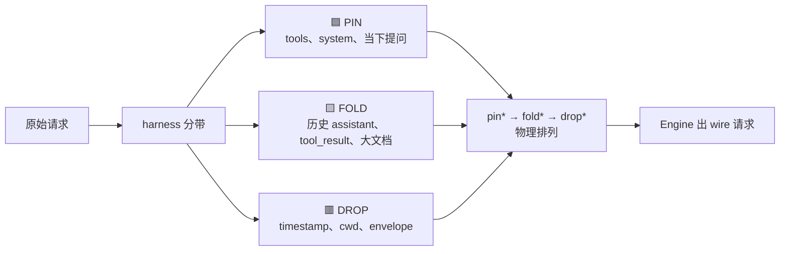
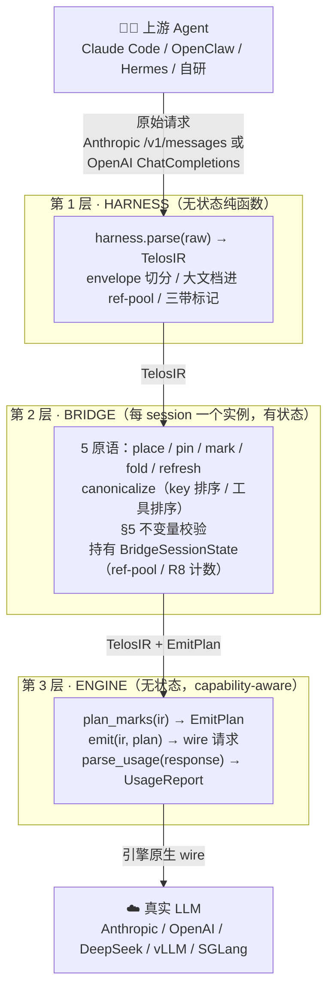
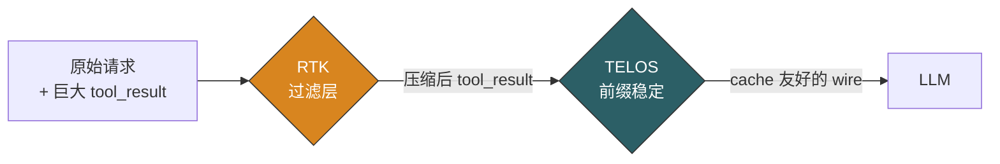
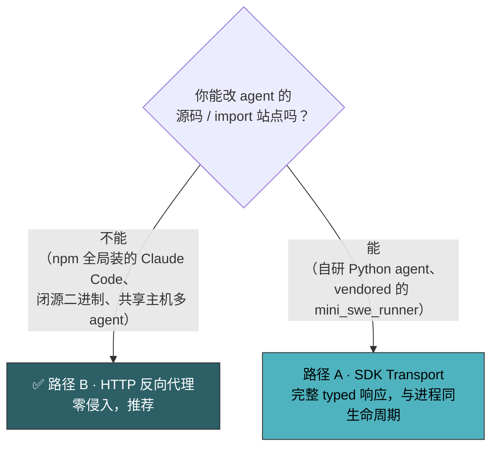
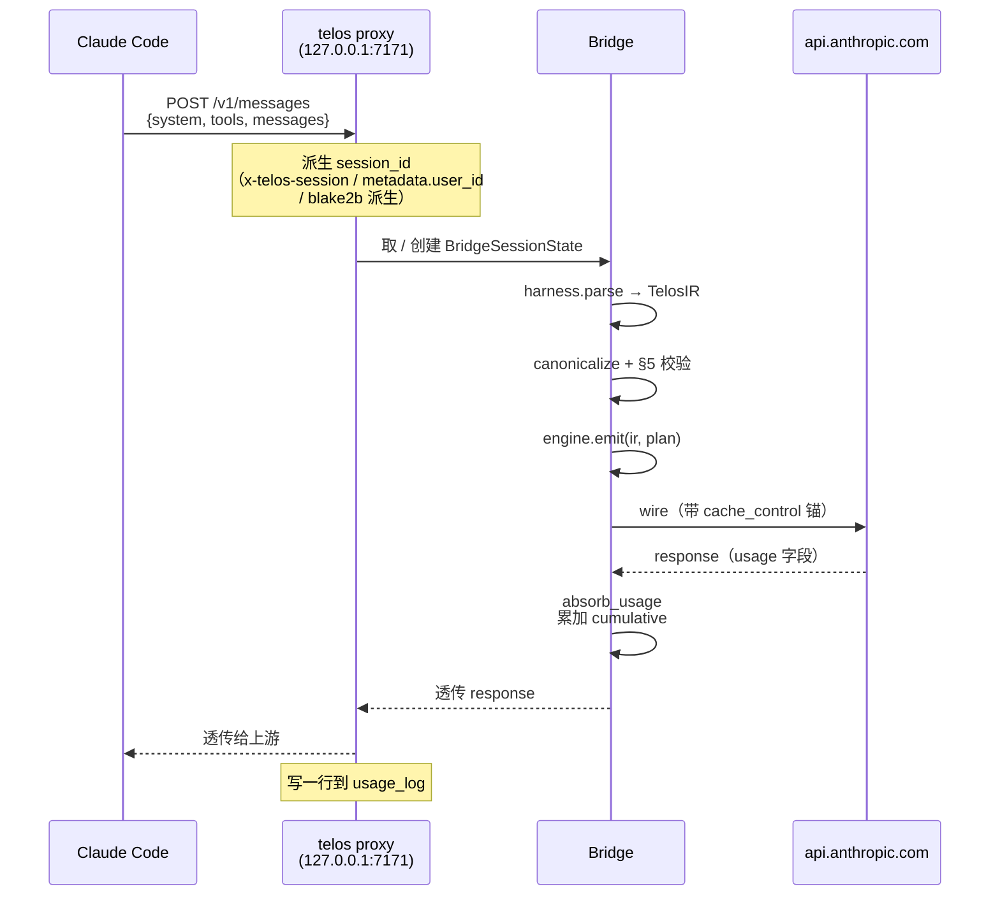
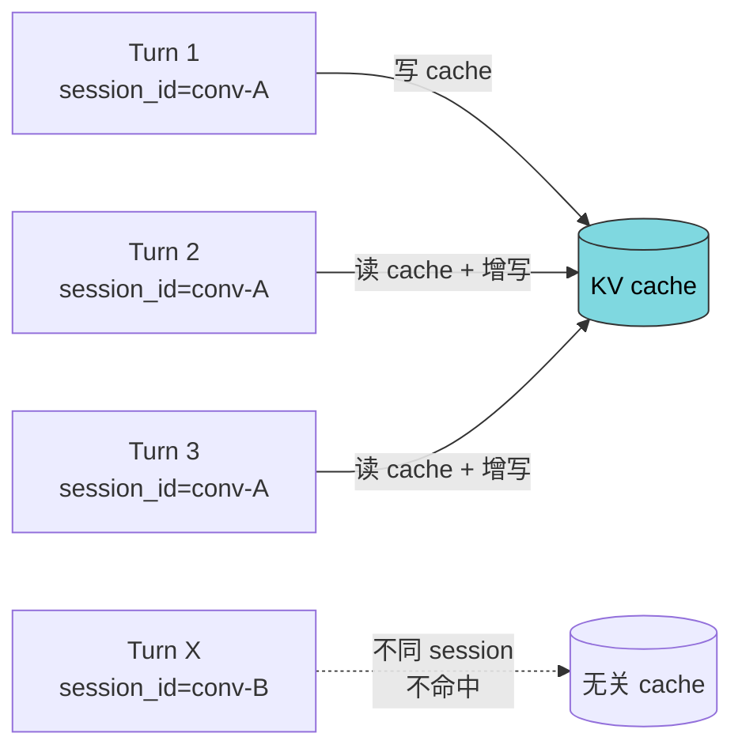
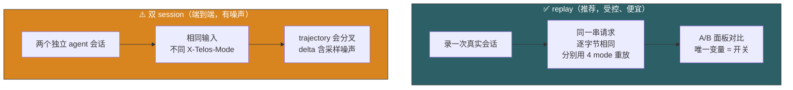
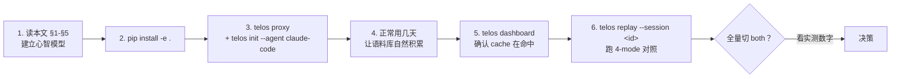

# TELOS Playbook — 图文版用户手册

<div align="center">


**让 KV cache 真的命中你的 agent，让钱真的省下来。**

<sub>📖 想要 CLI 字典 → [User-guide.md](User-guide.md) ｜ 想看代码架构 → [ARCHITECTURE.md](ARCHITECTURE.md) ｜ 想看协议规范 → [TELOS Protocol](2026-05-06-telos-protocol.md)</sub>

<sub>最后更新：2026-05-18</sub>

</div>

---

## 目录

1. [3 分钟读懂 TELOS](#1-3-分钟读懂-telos)
2. [心智模型 · 一座石碑](#2-心智模型--一座石碑)
3. [三色带：PIN / FOLD / DROP](#3-三色带pin--fold--drop)
4. [三层架构总览](#4-三层架构总览)
5. [两条正交优化线（TELOS + RTK）](#5-两条正交优化线telos--rtk)
6. [安装](#6-安装)
7. [选接入路径](#7-选接入路径)
8. [路径 B · HTTP 反向代理（推荐）](#8-路径-b--http-反向代理推荐)
9. [路径 A · SDK Transport](#9-路径-a--sdk-transport)
10. [多轮状态累积](#10-多轮状态累积)
11. [三个看板：实时看健康，事后算账](#11-三个看板实时看健康事后算账)
12. [对比实验：replay vs 双 session](#12-对比实验replay-vs-双-session)
13. [最佳实践（DO）与反模式（DON'T）](#13-最佳实践do与反模式dont)
14. [故障排查](#14-故障排查)
15. [推荐上手顺序](#15-推荐上手顺序)

---

## 1. 3 分钟读懂 TELOS

### 1.1 钱花在哪了

一个跑 20 轮的编码 agent，每轮请求都会把 **system prompt + 工具定义 + 整段对话历史** 全部重新发给模型。第 20 轮的请求里，**95% 内容和第 19 轮一字不差**。

```
轮次:    1     2     3     4    ...    19    20
        ┌─┐  ┌──┐  ┌───┐ ┌────┐       ┌─────┐┌──────┐
input:  │ │  │  │  │   │ │    │  ...  │     ││      │
        └─┘  └──┘  └───┘ └────┘       └─────┘└──────┘
       新   重     重    重           重     重重重重(95%)
```

LLM 推理引擎的 **KV cache** 本可以把这些重复前缀的计算结果留住，命中时 input token 只按 ~10% 计价（Anthropic）。但 cache 命中有一个苛刻前提 ——

> **前缀必须逐字节稳定。** 而 agent 的请求默认做不到。

任意一个抖动（JSON key 乱序、工具数组重排、时间戳混进前缀、某个 `tool_result` 被改写），前缀 hash 就变，cache 整段失效，**这一轮按全价计费**。

### 1.2 TELOS 做的唯一一件事

> **把真正稳定的部分稳住，让它持续命中 KV cache。**

TELOS 不是一个"更聪明的 prompt 框架"。它只做一件事 —— 识别请求里哪些是石碑底座（一刻一辈子的稳定前缀），哪些是可擦改的题字（每轮新增），然后保证底座的字节绝不因为可避免的原因抖动。

### 1.3 名字的来源

**TELOS** = **S**table prefix · **T**iered bands · **E**phemeral tail · **L**ayered adapters · **A**nchored marks。

取古希腊石碑（telos）之意：底座的铭文刻一次用一辈子；上方按时间累加的题字随时可擦改，但绝不动到底座。KV cache 的全部价值就是把底座留住。

---

## 2. 心智模型 · 一座石碑

```
              ╔════════════════════════════╗
              ║   Drop 带（每轮即焚）       ║   ← timestamp / cwd / git
              ║   "2026-05-18 14:32 …"      ║      / <system-reminder>
              ╠════════════════════════════╣
              ║   Fold 带（可折叠题字）     ║   ← assistant 历史回答
              ║   "你给的代码我看了 …"      ║      tool_result、大文档
              ║                            ║
              ╠════════════════════════════╣
              ║                            ║
              ║   Pin 带（底座铭文）        ║   ← 工具定义 / system prompt
              ║   "You are an engineer …"   ║      / 用户当下提问
              ║   ╭──────────────╮         ║
              ║   │ ◆ TOOLS ◆    │         ║
              ║   │ ◆ SYSTEM ◆   │         ║
              ║   │ ◆ REF-POOL ◆ │         ║
              ║   ╰──────────────╯         ║
              ╚════════════════════════════╝
                       一座石碑 / 一段 prompt
```

- **底座（PIN）** 刻得最深、字节最稳，KV cache 主要命中的就是它。
- **中段（FOLD）** 是历史题字，可缓存；但 compact / refresh 时可以被擦改成更短的摘要。
- **顶部（DROP）** 是每轮都变的字（时间戳之类），永远不进 cache hash —— 把它赶到末尾，前面的底座+题字才稳得住。

**唯一硬规则**：每段内容里，三色带必须物理排成 `PIN → FOLD → DROP`。

---

## 3. 三色带：PIN / FOLD / DROP



| 带 | 进 cache hash？ | 典型内容 | 寿命 |
|---|:---:|---|---|
| 🟦 **PIN** | ✓（最重要） | 工具定义 / system prompt / 用户当下提问 | 一刻一辈子 |
| 🟨 **FOLD** | ✓（可丢） | assistant 历史 / tool_result / >2KB 大文档（进 ref-pool） | 可被 compact 替换成摘要 |
| 🟥 **DROP** | ✗ | 时间戳 / cwd / git status / `<system-reminder>` envelope | 每轮新生成 |

### 3.1 大文档进 "ref-pool"（指针表）

System prompt 里塞一份 50KB 的项目文档？TELOS 会自动把它注册到 **ref-pool**，原地留一个 PIN stub 指针。多轮里这个 slug 冻结、payload 哪怕变了 slug 也不变 —— 前缀 hash 因此保持稳定。

```
原始 system prompt:
    "你是一个工程师。
     <file path='spec.md'>...50KB 内容...</file>"

  ↓  harness 自动拆分

PIN 段:  "你是一个工程师。[ref:spec-md]"
        （只有这条进 cache 前缀 hash）
ref-pool:
        spec-md → 50KB 内容（FOLD 带，可压缩）
```

---

## 4. 三层架构总览



**核心不变量**：跨请求状态只能存在于第 2 层。Harness 和 Engine 都是纯函数 / 无状态对象，相同输入永远输出相同结果。这让 wire 字节对哪条引擎、哪个序列化器都是确定的。

---

## 5. 两条正交优化线（TELOS + RTK）

TELOS 稳的是**请求前缀**。但 agent 每轮还会往对话尾巴追加大段工具输出（bash / pytest / docker 日志，动辄几千 token）。这部分 TELOS 管不到。

所以有第二条线 —— **RTK 输出过滤**（吸收 [rtk-ai/rtk](https://github.com/rtk-ai/rtk) 的思路）：在请求进 TELOS 之前，把 `tool_result` 里的大段重复输出压掉。



两条线互相独立，由一个四态开关控制：

| 开关 | TELOS 前缀缓存 | RTK 工具过滤 | 何时用 |
|---|:---:|:---:|---|
| `none` | ✗ | ✗ | baseline 对照组 |
| `telos` | ✓ | ✗ | **生产默认推荐**（不改工具结果字节） |
| `rtk` | ✗ | ✓ | 工具输出特别巨大、对前缀不敏感 |
| `both` | ✓ | ✓ | 验证过工具输出可压后开（最大节省） |

> 不开 RTK：前缀 cache 命中再高，每轮的工具输出仍线性撑大对话。
> 不开 TELOS：工具输出缩了，但稳定前缀仍每轮重算。**两条线合起来收益最大。**

---

## 6. 安装

```bash
cd /path/to/telos-sdk
python3.11 -m venv .venv
source .venv/bin/activate
pip install -e .
```

验证：

```bash
python -c "import telos; print(telos.__file__)"   # .../telos-sdk/__init__.py
telos --help                                       # proxy / init / dashboard / replay
```

依赖：Python ≥ 3.10 / `anthropic ≥ 0.49` / `openai ≥ 1.72` / `aiohttp ≥ 3.10`。

> RTK 过滤想用真 rtk 引擎需另装 `rtk` 二进制；没装也能用，自动退回纯 Python fallback 过滤器，开关仍生效。

---

## 7. 选接入路径



两条路径**功能等价**（同一 TELOS 管线、同一状态累积），区别只在进程边界 / 错误处理 / 流式。**没有特殊理由就选路径 B。**

| | 路径 A · SDK Transport | 路径 B · HTTP 代理 |
|---|---|---|
| 接入 | `import` 改一行 | `telos proxy` + `ANTHROPIC_BASE_URL` |
| 流式 | ⚠️ 不 wrap，透传 | ✅ 完整 SSE |
| 多 agent 共享 | ✗ 每个 agent 单独改 | ✅ 一份代理共享 |
| `npm update` 影响 | 视语言而定 | 不丢配置 |
| 自定义 header | 全部透传 | 只白名单 6 个 |
| typed response | ✅ 完整 | ✅（wire 透传） |

---

## 8. 路径 B · HTTP 反向代理（推荐）

### 8.1 Claude Code（最常见，三步）

```bash
# ① 起代理（默认 mode=telos，默认录会话到 ~/.telos/corpus）
telos proxy --usage-log ~/.telos/usage.jsonl

# ② 一行接入 Claude Code（patch ~/.claude/settings.json 的 env 字段）
telos init --agent claude-code

# ③ 正常用 claude —— 流量自动经过代理
claude
```

`telos init` **不改 npm 包**、**不改 PATH**，`npm update` 也不会丢配置。

撤销 / 查状态：

```bash
telos init --agent claude-code --uninstall   # 精确还原 install 前状态
telos init --agent claude-code --status
```

### 8.2 代理工作流（细节）



### 8.3 其它 Anthropic-SDK 客户端

```bash
telos init --agent generic    # 打印 export 指令，自己加到 shell rc / Dockerfile / k8s env
# export ANTHROPIC_BASE_URL=http://127.0.0.1:7171
```

适用于 Cursor、Gemini CLI、自研 Node/Python agent —— 任何尊重 `ANTHROPIC_BASE_URL` 的客户端。

---

## 9. 路径 A · SDK Transport

把 `anthropic.Anthropic()` 换成 `TelosAnthropicTransport`，`.messages.create()` 调用一字不改：

```python
# 改前
import anthropic
client = anthropic.Anthropic()

# 改后
from telos.scripts.telos_anthropic_transport import TelosAnthropicTransport
client = TelosAnthropicTransport(
    session_id="my-agent-session",        # 同一对话用同一 id
    usage_log="logs/usage.jsonl",
    prompt_trace_log="logs/trace.jsonl",  # 可选：诊断 IR layout
)

# 调用完全不变
response = client.messages.create(
    model="claude-opus-4-7", max_tokens=8192,
    system=[...], tools=[...], messages=[...],
)
```

OpenAI 形状的 agent 用 `TelosOpenAITransport`（`.chat.completions.create`）：

```python
from telos.scripts.telos_transport import TelosOpenAITransport
client = TelosOpenAITransport(
    base_url="https://openrouter.ai/api/v1",
    session_id="telos-session",
    engine_name="deepseek",   # 或 "openai"
    harness_name="telos",
)
```

详细构造参数表：[User-guide.md §3](User-guide.md#3-路径-asdk-transport代码内接入)。

> ⚠️ **流式注意**：SDK transport 当前 **不 wrap** `messages.create(stream=True)`，会直接透传到底层 SDK 跳过 TELOS。要流式就走路径 B（代理完整 SSE 支持）。

---

## 10. 多轮状态累积

cache 累积的关键 = **同一对话用同一 `session_id`**。每轮命中的不是单条请求的 cache，而是过去 N 轮共同建立的 cache。



### 10.1 session_id 是谁定的？

- **路径 A**：`TelosAnthropicTransport(session_id=...)` 显式传，整段对话用同一个 transport 实例即可。
- **路径 B**：代理按以下优先级**自动派生**：
  1. `x-telos-session` HTTP header（显式覆盖）
  2. `metadata.user_id`（Anthropic SDK 内建字段）
  3. `blake2b(api_key + system + tools + messages[0])` → `telos-<16 hex>`

> 派生规则的语义保证：同一对话 N 轮 → 同一 id ✓ ；不同初始 prompt → 不同 id ✓ ；不同用户 → 不同 id ✓ 。代理 LRU 默认 10000 个 session，长跑超出按需调 `max_sessions=`。

### 10.2 看累积有没有工作

`usage_log` 每行带 `cumulative` 块：

```json
{
  "session_id": "telos-46bbb9d3d3df581e",
  "call_index": 4,
  "normalized": {"raw_input": 50, "cache_read": 6500, "cache_write": 0, "output": 5},
  "cumulative": {
    "cache_creation": 6500,
    "real_requests_since_refresh": 4,
    "refpool_slugs": ["system-doc-1"]
  }
}
```

**健康信号**（详见 [§14](#14-故障排查)）：

```bash
jq -c '{call: .call_index, cache_read: .normalized.cache_read, cum: .cumulative.cache_creation}' \
    < ~/.telos/usage.jsonl
```

`cache_read` 随轮次上升、`cache_creation` 单调递增、`refpool_slugs` 不反复增长 = 一切正常。

---

## 11. 三个看板：实时看健康，事后算账

<div align="center">


<sub>省钱看板：按 harness / model / session 算<strong>绝对美元节省</strong> —— 不是可以靠缩小分母刷出来的比率。</sub>

</div>

| 看板 | 入口 | 看什么 | 用法 |
|---|---|---|---|
| 💰 **省钱看板** | `/__telos/dashboard` 或 `telos dashboard` | 省了多少 token / 美刀、A/B 对比、mode breakdown | 给老板看 |
| 🔬 **开发者页面** | `/__telos/developer` | 当前内存里每 session 的 IR 结构、PIN/FOLD/DROP 分布、工具统计 | 自查 cache 命中行为 |
| 📜 **usage_log** | `~/.telos/usage.jsonl` | 逐调用的原始数据 | `jq` / 自己画图 |

> 字段对照见 [dashboard-savings-metrics.md](dashboard-savings-metrics.md) 和 [dashboard-developer-metrics.md](dashboard-developer-metrics.md)。

---

## 12. 对比实验：replay vs 双 session

> 想知道"开 TELOS / RTK 到底省多少钱"？最忌讳的就是凭感觉。TELOS 提供两种**受控对照**。



### 12.1 replay：跑过的录像，钉死轨迹

```bash
telos replay --list                              # 看语料库里有哪些会话
telos replay --session <id>                       # 默认 4 mode 全跑
telos dashboard --usage-log ~/.telos/usage.jsonl  # A/B 对比面板看结果
```

每个 mode 看到的输入完全一致，**唯一变量是开关本身**。成本低：1 次真实会话 + 每 mode 一串廉价 `max_tokens=1` prefill 调用。

### 12.2 双 session：端到端，但单次不可信

起两个独立 agent 会话、用户输入相同，各带不同 `X-Telos-Mode` + 相同 `X-Telos-Compare-Group`，dashboard 同一面板并排。

**单次跑的 delta 不可信**（trajectory 因为采样会分叉、工具结果不同导致后续决策不同）。**只在偶尔做端到端校验时用**，且要多跑取平均。

| | replay | 双 session |
|---|---|---|
| 控制变量 | ✅ 字节级钉死 | ✗ trajectory 会分叉 |
| 成本 | 极低（prefill `max_tokens=1`） | 端到端全价 |
| 测量 | prefill / cache 计费 | 端到端任务成本 |
| 适用 | **日常对照、CI 基准** | 偶尔端到端校验 |

详细原理与边界：[replay-comparison.md](replay-comparison.md)。

---

## 13. 最佳实践（DO）与反模式（DON'T）

### ✅ DO

1. **同一对话用同一 `session_id`**。多轮 cache 累积全靠它。
2. **先 `telos` 后 `both`**。先验证 TELOS 前缀缓存稳定无异常，再叠加会改写工具结果的 RTK。
3. **接入后第一件事看 dashboard**。`/__telos/dashboard` 或 `telos dashboard`，确认 `cache_read` 在涨、`cache hit%` 合理。
4. **用 replay 决定要不要全量开某个 mode**。别凭感觉，跑一次 replay 看 A/B 面板的实测数字。
5. **让代理一直录会话**（默认开启）。语料库是 replay 的燃料，也是回归基准。介意原始 prompt 落盘才用 `--no-record`。
6. **生产用非 strict（默认）**。TELOS 失败自动降级 passthrough，正确性永不受影响；`--strict` 只在 dev 调试时用。
7. **长跑 / 高并发场景调 `max_sessions`**。代理 LRU 默认上限 10000。

### ❌ DON'T

| 别这样 | 为什么 | 改成 |
|---|---|---|
| SDK transport 路径用 `stream=True` | 流式没接 TELOS 处理，直接透传 | 路径 A 用非流式；要流式走路径 B |
| 每轮换 `session_id` | cache 累积归零，`cache_creation` 永远 0 | 整段对话固定一个 id |
| 把每轮变化的内容（时间戳/cwd）塞进 system prompt 头部 | 污染 PIN 前缀，cache 整段失效 | 它们会被 harness 归到 DROP；别手动前置 |
| 指望 RTK 改 agent 的本地上下文 | RTK 只过滤 proxy→上游这一段，agent 本地副本不变 | 这是设计如此；省的是计费 token |
| 凭单次双 session 跑分下结论 | trajectory 分叉，delta 是噪声 | 用 replay，或双 session 多跑取平均 |
| 把 replay 数字当端到端任务成本 | replay 把轨迹钉死、`max_tokens=1` 不计 output | replay 测的是 prefill/缓存计费；端到端用双 session |
| 自定义 header 指望透传 | 代理只白名单转发 6 个 header | 改 `_FORWARD_HEADER_WHITELIST`，或走路径 A |

---

## 14. 故障排查

### 14.1 速查表

| 现象 | 根因 | 修法 |
|---|---|---|
| `cache_read` 永远 0 | session_id 每轮在变 / 模型不支持 prompt caching / `cache_control` 没生效 | 固定 session_id；确认模型支持；看 dashboard 的 hit% |
| `cumulative.cache_creation` 永远 0 | 没传 `session_state`（路径 A）或代理重启过 | 路径 A 显式传 `session_state`；路径 B 别频繁重启 |
| 看到 `passthrough` 记录 | TELOS 管线抛异常、自动降级 | 看代理日志首次 traceback；dev 阶段加 `--strict` 让它显式爆 |
| `TelosInvariantError: Band order violated` | harness 输出违反 §5 | TELOS-side bug；扩展新 harness 时 message 末尾过一遍 `enforce_band_order` |
| RTK 没省下 token | 工具输出短于 600 字符阈值 / 没有重复 | 正常；小输出本就不值得过滤 |
| `rtk` mode 但 dashboard 显示 `fallback:*` rule | `rtk` 二进制没装 | 装 rtk 二进制，或接受 Python fallback |
| 自定义 header 丢失 | 代理只白名单转发 6 个 header | 改 `_FORWARD_HEADER_WHITELIST` 或走路径 A |
| replay 报缺 API key | 没设 `ANTHROPIC_API_KEY` | `export ANTHROPIC_API_KEY=...` 或 `--api-key` |

### 14.2 jq 三连查健康

```bash
# 多轮 cache_read 是否在涨（命中在工作）
jq -c '{call: .call_index, cache_read: .normalized.cache_read, cum: .cumulative.cache_creation}' \
    < ~/.telos/usage.jsonl

# ref-pool 是否稳定（同一文档不应反复重新注册）
jq -c '.cumulative.refpool_slugs' < ~/.telos/usage.jsonl | sort -u

# 有没有降级到 passthrough（TELOS 出错的信号）
jq -c 'select(.harness == "passthrough")' < ~/.telos/usage.jsonl
```

健康 = `cache_read` 随轮次上升、`cache_creation` 单调递增、`refpool_slugs` 不反复增长、没有 `passthrough` 记录。

---

## 15. 推荐上手顺序



走到第 7 步还想深入：

- **代码架构** → [ARCHITECTURE.md](ARCHITECTURE.md)
- **协议规范** → [TELOS Protocol](2026-05-06-telos-protocol.md)
- **CLI 字典** → [User-guide.md](User-guide.md)
- **对照实验原理** → [replay-comparison.md](replay-comparison.md)
- **基准测试** → [TELOS Benchmark Guide](2026-05-06-telos-benchmark-guide.md)

---

<div align="center">
<sub>—— TELOS —— 让稳定的部分稳住，让不稳定的部分赶到末尾 ——</sub>
</div>
