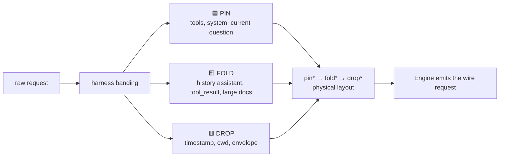
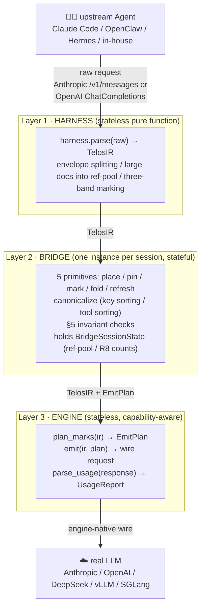
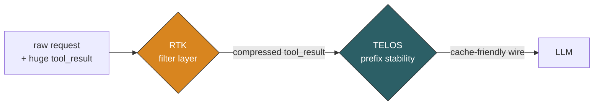
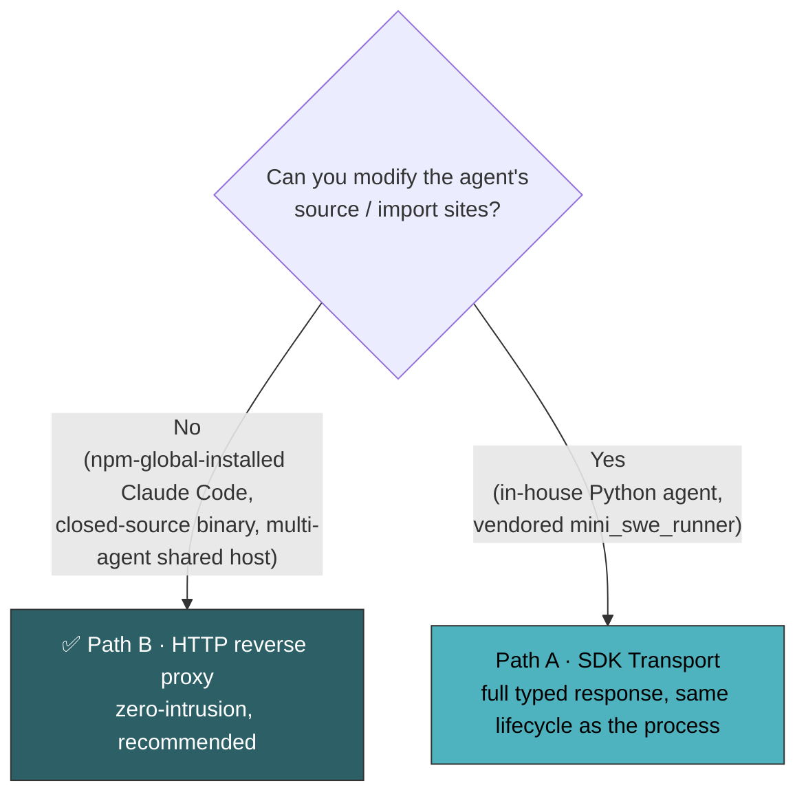
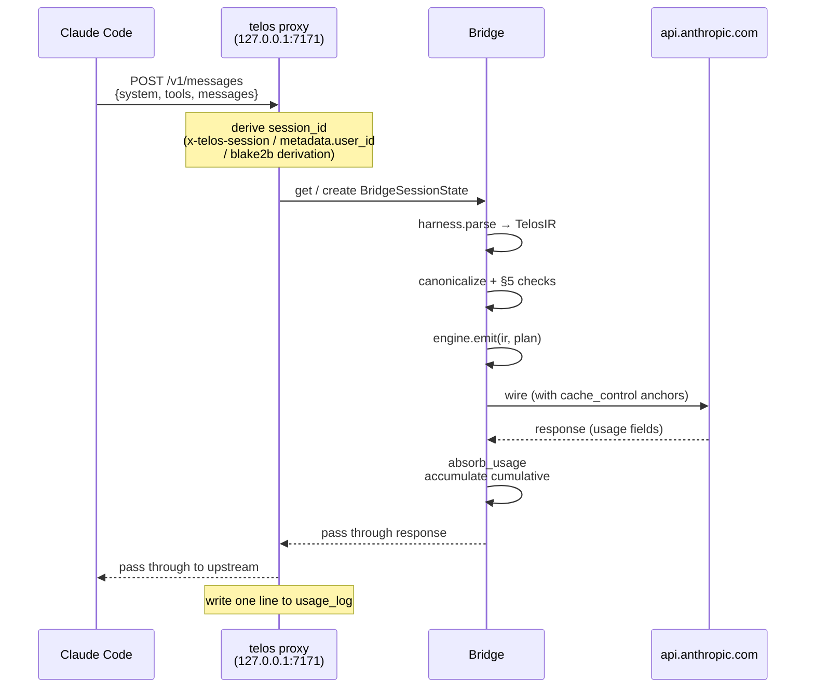
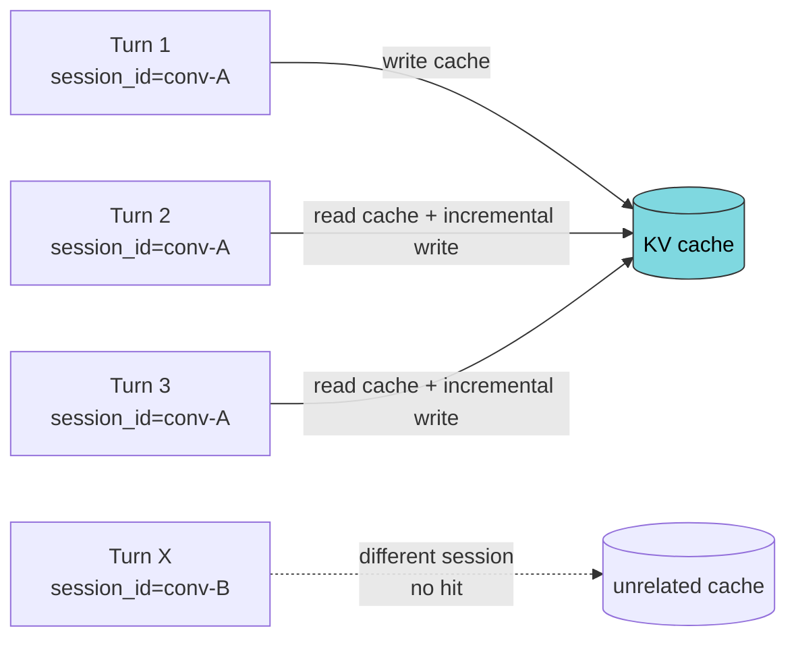
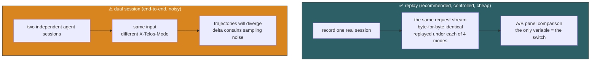
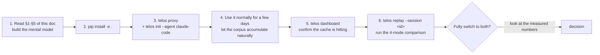

# TELOS Playbook — Illustrated User Manual

<div align="center">


**Make the KV cache truly hit your agent, and make the savings real.**

<sub>📖 Want the CLI reference → [User-guide.md](User-guide.md) ｜ Want the code architecture → [ARCHITECTURE.md](ARCHITECTURE.md) ｜ Want the protocol spec → [TELOS Protocol](2026-05-06-telos-protocol.md)</sub>

<sub>Last updated: 2026-05-18</sub>

</div>

---

## Table of Contents

1. [Understand TELOS in 3 minutes](#1-understand-telos-in-3-minutes)
2. [Mental model · a stone stele](#2-mental-model--a-stone-stele)
3. [Three color bands: PIN / FOLD / DROP](#3-three-color-bands-pin--fold--drop)
4. [Three-layer architecture overview](#4-three-layer-architecture-overview)
5. [Two orthogonal optimization lines (TELOS + RTK)](#5-two-orthogonal-optimization-lines-telos--rtk)
6. [Installation](#6-installation)
7. [Choose an integration path](#7-choose-an-integration-path)
8. [Path B · HTTP reverse proxy (recommended)](#8-path-b--http-reverse-proxy-recommended)
9. [Path A · SDK Transport](#9-path-a--sdk-transport)
10. [Multi-turn state accumulation](#10-multi-turn-state-accumulation)
11. [Three dashboards: watch health live, settle accounts after](#11-three-dashboards-watch-health-live-settle-accounts-after)
12. [Comparison experiments: replay vs dual session](#12-comparison-experiments-replay-vs-dual-session)
13. [Best practices (DO) and anti-patterns (DON'T)](#13-best-practices-do-and-anti-patterns-dont)
14. [Troubleshooting](#14-troubleshooting)
15. [Recommended onboarding order](#15-recommended-onboarding-order)

---

## 1. Understand TELOS in 3 minutes

### 1.1 Where the money goes

A coding agent that runs 20 turns re-sends the **system prompt + tool definitions + the entire conversation history** to the model on every request. In the 20th request, **95% of the content is byte-for-byte identical to the 19th turn**.

```
turn:    1     2     3     4    ...    19    20
        ┌─┐  ┌──┐  ┌───┐ ┌────┐       ┌─────┐┌──────┐
input:  │ │  │  │  │   │ │    │  ...  │     ││      │
        └─┘  └──┘  └───┘ └────┘       └─────┘└──────┘
       new  reuse reuse reuse        reuse  reuse reuse reuse(95%)
```

The LLM inference engine's **KV cache** could keep the computed results of these repeated prefixes, and on a hit the input tokens are billed at only ~10% (Anthropic). But a cache hit has one demanding precondition ——

> **The prefix must be byte-stable.** And by default an agent's requests can't deliver that.

Any jitter (JSON keys reordered, tool array reshuffled, a timestamp mixed into the prefix, some `tool_result` rewritten) changes the prefix hash, the entire cache is invalidated, and **that turn is billed at full price**.

### 1.2 The one thing TELOS does

> **Hold the truly stable parts stable, so they keep hitting the KV cache.**

TELOS is not a "smarter prompt framework." It does exactly one thing —— identify which parts of a request are the stele base (a stable prefix that lasts a lifetime) and which are the erasable inscription (added each turn), then guarantee the base's bytes never jitter for avoidable reasons.

### 1.3 Where the name comes from

**TELOS** = **S**table prefix · **T**iered bands · **E**phemeral tail · **L**ayered adapters · **A**nchored marks.

It takes the meaning of the ancient Greek stone stele (telos): the inscription carved into the base is carved once and used for a lifetime; the inscriptions added on top over time can be erased anytime, but the base is never touched. The entire value of the KV cache is in keeping the base intact.

---

## 2. Mental model · a stone stele

```
              ╔════════════════════════════╗
              ║   Drop band (burned each turn) ║   ← timestamp / cwd / git
              ║   "2026-05-18 14:32 …"      ║      / <system-reminder>
              ╠════════════════════════════╣
              ║   Fold band (collapsible inscription) ║   ← assistant history replies
              ║   "I've looked at the code you gave …" ║      tool_result, large docs
              ║                            ║
              ╠════════════════════════════╣
              ║                            ║
              ║   Pin band (base inscription) ║   ← tool defs / system prompt
              ║   "You are an engineer …"   ║      / user's current question
              ║   ╭──────────────╮         ║
              ║   │ ◆ TOOLS ◆    │         ║
              ║   │ ◆ SYSTEM ◆   │         ║
              ║   │ ◆ REF-POOL ◆ │         ║
              ║   ╰──────────────╯         ║
              ╚════════════════════════════╝
                   one stone stele / one prompt
```

- **The base (PIN)** is carved the deepest and is the most byte-stable; it is what the KV cache mainly hits.
- **The middle (FOLD)** is the historical inscription, cacheable; but during compact / refresh it can be erased and rewritten into a shorter summary.
- **The top (DROP)** is the text that changes every turn (timestamps and the like), and never enters the cache hash —— drive it to the tail so the base + inscription in front stay stable.

**The one hard rule**: within every piece of content, the three color bands must be physically arranged as `PIN → FOLD → DROP`.

---

## 3. Three color bands: PIN / FOLD / DROP



| Band | Enters cache hash? | Typical content | Lifetime |
|---|:---:|---|---|
| 🟦 **PIN** | ✓ (most important) | tool definitions / system prompt / user's current question | a lifetime once carved |
| 🟨 **FOLD** | ✓ (droppable) | assistant history / tool_result / large docs >2KB (enter the ref-pool) | can be replaced by a compact summary |
| 🟥 **DROP** | ✗ | timestamp / cwd / git status / `<system-reminder>` envelope | regenerated each turn |

### 3.1 Large documents enter the "ref-pool" (pointer table)

Stuffed a 50KB project document into the system prompt? TELOS automatically registers it into the **ref-pool**, leaving a PIN stub pointer in place. Across turns this slug is frozen, and even if the payload changes the slug does not —— so the prefix hash stays stable.

```
original system prompt:
    "You are an engineer.
     <file path='spec.md'>...50KB of content...</file>"

  ↓  harness splits it automatically

PIN segment:  "You are an engineer.[ref:spec-md]"
              (only this line enters the cache prefix hash)
ref-pool:
              spec-md → 50KB of content (FOLD band, compressible)
```

---

## 4. Three-layer architecture overview



**Core invariant**: cross-request state can only live in Layer 2. Both the Harness and the Engine are pure functions / stateless objects, and identical input always yields identical output. This makes the wire bytes deterministic regardless of which engine or which serializer is used.

---

## 5. Two orthogonal optimization lines (TELOS + RTK)

What TELOS stabilizes is the **request prefix**. But every turn the agent also appends large blocks of tool output (bash / pytest / docker logs, easily several thousand tokens) to the tail of the conversation. TELOS cannot control that part.

So there is a second line —— **RTK output filtering** (absorbing the ideas of [rtk-ai/rtk](https://github.com/rtk-ai/rtk)): before the request enters TELOS, compress away the large repeated output inside `tool_result`.



The two lines are independent of each other, controlled by a four-state switch:

| Switch | TELOS prefix caching | RTK tool filtering | When to use |
|---|:---:|:---:|---|
| `none` | ✗ | ✗ | baseline control group |
| `telos` | ✓ | ✗ | **recommended production default** (does not alter tool-result bytes) |
| `rtk` | ✗ | ✓ | tool output is especially huge, prefix is not sensitive |
| `both` | ✓ | ✓ | enable once tool output is verified compressible (maximum savings) |

> Without RTK: no matter how high the prefix cache hit rate, each turn's tool output still grows the conversation linearly.
> Without TELOS: tool output shrinks, but the stable prefix is still recomputed every turn. **Combining the two lines yields the largest gain.**

---

## 6. Installation

```bash
cd /path/to/telos-sdk
python3.11 -m venv .venv
source .venv/bin/activate
pip install -e .
```

Verify:

```bash
python -c "import telos; print(telos.__file__)"   # .../telos-sdk/__init__.py
telos --help                                       # proxy / init / dashboard / replay
```

Dependencies: Python ≥ 3.10 / `anthropic ≥ 0.49` / `openai ≥ 1.72` / `aiohttp ≥ 3.10`.

> To use the real rtk engine for RTK filtering you need to separately install the `rtk` binary; without it RTK still works, automatically falling back to the pure-Python fallback filter, and the switch still takes effect.

---

## 7. Choose an integration path



The two paths are **functionally equivalent** (same TELOS pipeline, same state accumulation); they differ only in process boundary / error handling / streaming. **With no special reason, choose Path B.**

| | Path A · SDK Transport | Path B · HTTP proxy |
|---|---|---|
| Integration | change one `import` line | `telos proxy` + `ANTHROPIC_BASE_URL` |
| Streaming | ⚠️ not wrapped, passed through | ✅ full SSE |
| Shared by multiple agents | ✗ each agent modified separately | ✅ one proxy shared |
| `npm update` impact | depends on the language | config not lost |
| Custom headers | all passed through | only 6 whitelisted |
| typed response | ✅ full | ✅ (wire passthrough) |

---

## 8. Path B · HTTP reverse proxy (recommended)

### 8.1 Claude Code (most common, three steps)

```bash
# ① Start the proxy (default mode=telos, default records sessions to ~/.telos/corpus)
telos gateway start --usage-log ~/.telos/usage.jsonl

# ② One-line integration with Claude Code (patches the env field of ~/.claude/settings.json)
telos init --agent claude-code

# ③ Use claude normally —— traffic automatically goes through the proxy
claude
```

`telos init` **does not modify the npm package**, **does not modify PATH**, and `npm update` will not lose the config.

Undo / check status:

```bash
telos init --agent claude-code --uninstall   # precisely restore the pre-install state
telos init --agent claude-code --status
```

### 8.2 Proxy workflow (details)



### 8.3 Other Anthropic-SDK clients

```bash
telos init --agent generic    # prints export instructions, add them yourself to shell rc / Dockerfile / k8s env
# export ANTHROPIC_BASE_URL=http://127.0.0.1:7171
```

Applies to Cursor, Gemini CLI, in-house Node/Python agents —— any client that respects `ANTHROPIC_BASE_URL`.

---

## 9. Path A · SDK Transport

Replace `anthropic.Anthropic()` with `TelosAnthropicTransport`; the `.messages.create()` call needs no changes:

```python
# before
import anthropic
client = anthropic.Anthropic()

# after
from telos.scripts.telos_anthropic_transport import TelosAnthropicTransport
client = TelosAnthropicTransport(
    session_id="my-agent-session",        # use the same id for the same conversation
    usage_log="logs/usage.jsonl",
    prompt_trace_log="logs/trace.jsonl",  # optional: diagnose IR layout
)

# the call is completely unchanged
response = client.messages.create(
    model="claude-opus-4-7", max_tokens=8192,
    system=[...], tools=[...], messages=[...],
)
```

OpenAI-shaped agents use `TelosOpenAITransport` (`.chat.completions.create`):

```python
from telos.scripts.telos_transport import TelosOpenAITransport
client = TelosOpenAITransport(
    base_url="https://openrouter.ai/api/v1",
    session_id="telos-session",
    engine_name="deepseek",   # or "openai"
    harness_name="telos",
)
```

Detailed constructor parameter table: [User-guide.md §3](User-guide.md#3-path-a-sdk-transport-in-code-integration).

> ⚠️ **Streaming note**: the SDK transport currently **does not wrap** `messages.create(stream=True)`; it passes straight through to the underlying SDK, skipping TELOS. For streaming, use Path B (the proxy has full SSE support).

---

## 10. Multi-turn state accumulation

The key to cache accumulation = **use the same `session_id` for the same conversation**. What each turn hits is not the cache of a single request, but the cache jointly built by the past N turns.



### 10.1 Who sets the session_id?

- **Path A**: pass it explicitly via `TelosAnthropicTransport(session_id=...)`; just use the same transport instance for the entire conversation.
- **Path B**: the proxy **derives it automatically** by the following priority:
  1. `x-telos-session` HTTP header (explicit override)
  2. `metadata.user_id` (a built-in Anthropic SDK field)
  3. `blake2b(api_key + system + tools + messages[0])` → `telos-<16 hex>`

> The semantic guarantees of the derivation rule: same conversation across N turns → same id ✓ ; different initial prompt → different id ✓ ; different user → different id ✓ . The proxy LRU defaults to 10000 sessions; for long runs that exceed it, tune `max_sessions=` as needed.

### 10.2 Check whether accumulation is working

Each line of `usage_log` carries a `cumulative` block:

```json
{
  "session_id": "telos-46bbb9d3d3df581e",
  "call_index": 4,
  "normalized": {"raw_input": 50, "cache_read": 6500, "cache_write": 0, "output": 5},
  "cumulative": {
    "cache_creation": 6500,
    "real_requests_since_refresh": 4,
    "refpool_slugs": ["system-doc-1"]
  }
}
```

**Health signals** (see [§14](#14-troubleshooting) for details):

```bash
jq -c '{call: .call_index, cache_read: .normalized.cache_read, cum: .cumulative.cache_creation}' \
    < ~/.telos/usage.jsonl
```

`cache_read` rising with the turn count, `cache_creation` increasing monotonically, and `refpool_slugs` not repeatedly growing = everything is fine.

---

## 11. Three dashboards: watch health live, settle accounts after

<div align="center">


<sub>Savings dashboard: computes <strong>absolute dollar savings</strong> by harness / model / session —— not a ratio you can game by shrinking the denominator.</sub>

</div>

| Dashboard | Entry point | What it shows | Use |
|---|---|---|---|
| 💰 **Savings dashboard** | `/__telos/dashboard` or `telos dashboard` | how many tokens / dollars saved, A/B comparison, mode breakdown | show to the boss |
| 🔬 **Developer page** | `/__telos/developer` | the IR structure of each in-memory session right now, PIN/FOLD/DROP distribution, tool stats | self-check cache-hit behavior |
| 📜 **usage_log** | `~/.telos/usage.jsonl` | per-call raw data | `jq` / plot it yourself |

> For field mappings see [dashboard-savings-metrics.md](dashboard-savings-metrics.md) and [dashboard-developer-metrics.md](dashboard-developer-metrics.md).

---

## 12. Comparison experiments: replay vs dual session

> Want to know "how much money does enabling TELOS / RTK actually save"? The worst thing you can do is rely on a gut feeling. TELOS provides two kinds of **controlled comparison**.



### 12.1 replay: a recorded session, with the trajectory nailed down

```bash
telos replay --list                              # see which sessions are in the corpus
telos replay --session <id>                       # by default runs all 4 modes
telos dashboard --usage-log ~/.telos/usage.jsonl  # view results in the A/B comparison panel
```

The input each mode sees is exactly identical, and **the only variable is the switch itself**. Low cost: 1 real session + a stream of cheap `max_tokens=1` prefill calls per mode.

### 12.2 dual session: end-to-end, but a single run is not trustworthy

Start two independent agent sessions with identical user input, each carrying a different `X-Telos-Mode` plus the same `X-Telos-Compare-Group`, and the dashboard places them side by side in the same panel.

**The delta of a single run is not trustworthy** (the trajectory diverges due to sampling, and different tool results lead to different downstream decisions). **Use it only for the occasional end-to-end validation**, and run it multiple times to average.

| | replay | dual session |
|---|---|---|
| Control variable | ✅ nailed down at the byte level | ✗ trajectory will diverge |
| Cost | extremely low (prefill `max_tokens=1`) | full-price end-to-end |
| What it measures | prefill / cache billing | end-to-end task cost |
| Suitable for | **daily comparison, CI benchmark** | occasional end-to-end validation |

Detailed principles and boundaries: [replay-comparison.md](replay-comparison.md).

---

## 13. Best practices (DO) and anti-patterns (DON'T)

### ✅ DO

1. **Use the same `session_id` for the same conversation**. Multi-turn cache accumulation depends entirely on it.
2. **`telos` first, then `both`**. First verify TELOS prefix caching is stable with no anomalies, then layer on RTK, which rewrites tool results.
3. **The first thing after integration is to look at the dashboard**. `/__telos/dashboard` or `telos dashboard`; confirm `cache_read` is rising and `cache hit%` is reasonable.
4. **Use replay to decide whether to fully enable a mode**. Don't go by feel —— run a replay once and look at the measured numbers in the A/B panel.
5. **Let the proxy keep recording sessions** (on by default). The corpus is the fuel for replay and also a regression baseline. Use `--no-record` only if you object to raw prompts being written to disk.
6. **Use non-strict in production** (default). On a TELOS failure it automatically degrades to passthrough, so correctness is never affected; `--strict` is only for dev debugging.
7. **Tune `max_sessions` for long-running / high-concurrency scenarios**. The proxy LRU defaults to a cap of 10000.

### ❌ DON'T

| Don't do this | Why | Do this instead |
|---|---|---|
| Use `stream=True` on the SDK transport path | streaming is not wired to TELOS processing and passes straight through | use non-streaming on Path A; for streaming use Path B |
| Change the `session_id` every turn | cache accumulation resets to zero, `cache_creation` is always 0 | fix one id for the entire conversation |
| Stuff per-turn-changing content (timestamp/cwd) into the head of the system prompt | it pollutes the PIN prefix and the entire cache is invalidated | the harness will assign them to DROP; don't manually prepend them |
| Expect RTK to change the agent's local context | RTK only filters the proxy→upstream segment; the agent's local copy is unchanged | this is by design; what is saved is billed tokens |
| Draw conclusions from a single dual-session run | the trajectory diverges and the delta is noise | use replay, or run dual session multiple times and average |
| Treat replay numbers as end-to-end task cost | replay nails down the trajectory, and `max_tokens=1` does not count output | replay measures prefill/cache billing; use dual session for end-to-end |
| Expect custom headers to pass through | the proxy only whitelists and forwards 6 headers | modify `_FORWARD_HEADER_WHITELIST`, or use Path A |

---

## 14. Troubleshooting

### 14.1 Quick-reference table

| Symptom | Root cause | Fix |
|---|---|---|
| `cache_read` is always 0 | session_id changes every turn / model does not support prompt caching / `cache_control` did not take effect | fix the session_id; confirm the model supports it; check the dashboard's hit% |
| `cumulative.cache_creation` is always 0 | `session_state` was not passed (Path A) or the proxy was restarted | on Path A pass `session_state` explicitly; on Path B don't restart frequently |
| Seeing `passthrough` records | the TELOS pipeline threw an exception and degraded automatically | check the proxy log for the first traceback; in the dev stage add `--strict` to make it fail explicitly |
| `TelosInvariantError: Band order violated` | the harness output violates §5 | a TELOS-side bug; when extending a new harness, run `enforce_band_order` over the message tail once |
| RTK did not save tokens | tool output is shorter than the 600-character threshold / there is no repetition | normal; small output is not worth filtering anyway |
| `rtk` mode but the dashboard shows a `fallback:*` rule | the `rtk` binary is not installed | install the rtk binary, or accept the Python fallback |
| Custom headers are lost | the proxy only whitelists and forwards 6 headers | modify `_FORWARD_HEADER_WHITELIST` or use Path A |
| replay reports a missing API key | `ANTHROPIC_API_KEY` is not set | `export ANTHROPIC_API_KEY=...` or `--api-key` |

### 14.2 The jq health-check trio

```bash
# Whether multi-turn cache_read is rising (hits are working)
jq -c '{call: .call_index, cache_read: .normalized.cache_read, cum: .cumulative.cache_creation}' \
    < ~/.telos/usage.jsonl

# Whether the ref-pool is stable (the same document should not be repeatedly re-registered)
jq -c '.cumulative.refpool_slugs' < ~/.telos/usage.jsonl | sort -u

# Whether there was a degradation to passthrough (a signal that TELOS errored)
jq -c 'select(.harness == "passthrough")' < ~/.telos/usage.jsonl
```

Healthy = `cache_read` rising with the turn count, `cache_creation` increasing monotonically, `refpool_slugs` not repeatedly growing, and no `passthrough` records.

---

## 15. Recommended onboarding order



After step 7, if you want to go deeper:

- **Code architecture** → [ARCHITECTURE.md](ARCHITECTURE.md)
- **Protocol spec** → [TELOS Protocol](2026-05-06-telos-protocol.md)
- **CLI reference** → [User-guide.md](User-guide.md)
- **Comparison experiment principles** → [replay-comparison.md](replay-comparison.md)
- **Benchmarking** → [TELOS Benchmark Guide](2026-05-06-telos-benchmark-guide.md)

---

<div align="center">
<sub>—— TELOS —— hold the stable parts stable, drive the unstable parts to the tail ——</sub>
</div>
