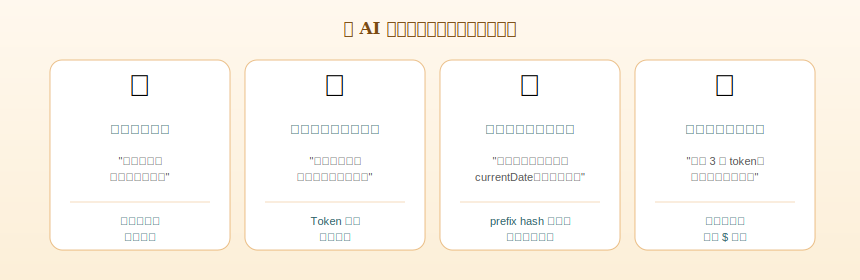

<div align="center">


# TELOS on SWE-bench Verified

### 不以正确率换 Token：一份预先登记的双臂 A/B 评估

**Zheng Wang · Shenzhi Wang · HongTao Zhong · Shiji Song · Gao Huang**

<sub>LEAP Lab, 清华大学 · <a href="https://www.leaplab.ai/">leaplab.ai</a> · 2026 年 5 月</sub>

</div>

---

## 摘要

大语言模型 agent 的运行成本主要由 prompt 侧重复计费的 raw input token 主导。尽管现代推理框架已经为前缀缓存（prefix caching）提供了引擎级支持 [1, 2, 3]，多数 agent harness 仍以"prompt 即可任意改写"的方式构造请求，使得本可命中的 KV-cache 在每一轮被结构性破坏。本文提出 **TELOS**——一份带类型约束（PIN/FOLD/DROP 三色带）与单调追加（monotonic append）不变量的上下文中间表示——并通过一次**预先登记**（pre-registered）的双臂 A/B 评估，量化它对 agent 任务正确率与 token 经济学的实际影响。在 SWE-bench Verified [4] 上，对 100 个随机抽样实例 / 臂使用 Hermes harness 与 `deepseek/deepseek-v4-flash` 模型运行，并在官方 Docker 评测 [4, 5] 上比较：TELOS 与 vanilla 的修复率分别为 41.8% vs 45.5%（n=55；95% Wilson 区间 [6] 几乎完全重叠；配对 McNemar 检验 [7] *p* ≈ 1.00），统计上不可区分；而每任务计费 raw_input token 下降 **−52.8%**，cache share 上升 **+11.9 pp**，output token 与 API 调用次数变化均小于 ±2%。我们认为这是 prompt-side 协议层优化与任务能力之间可分离的实证证据，并讨论了样本规模、子集偏置与外推性等约束。

**关键词**：LLM agent · KV-cache · prompt engineering · SWE-bench · 评估方法学

<sub>📖 完整协议规范、安装与 dashboard 工具见项目主 README（[English](../README.md) · [中文](../README.zh-CN.md)）。本文聚焦于实验设计、统计推断与外推性边界，不重述协议细节。</sub>

**图目录**　图 1（agent token 计费结构）· 图 1b（协议失效模式）· 图 2（PIN/FOLD/DROP 三色带）· 图 3（单调追加性质）· 图 4（savings dashboard）。

---

## 1 · 引言

### 1.1 计费层级几何下的"X 倍"陷阱

<p align="center">
  
</p>

<p align="center"><sub><strong>图 1.</strong> 当前 agent 工作流的 token 计费结构。每轮请求中可被复用的 PIN/FOLD 字节被 DROP 字段反复推后，导致引擎层 cache 无法命中——本可走 cache_read 通道（廉价）的字节被按 raw input（全价）重复计费。</sub></p>

2026 年的商用 LLM API 价目表上，同一家族不同输入类型之间的单位价格差已达**两个数量级**——Anthropic 与 DeepSeek 公布的 cache_read 单价与 raw input 单价之比通常在 1:10 到 1:14 之间，OpenAI 的 prompt caching 折扣亦在 50% 量级 [8, 9]。这一价格几何使得任何"X 倍 token 节省"的相对指标都失去了校准基线：把廉价的 cache_read 计入分母即可造出任意大的节省比例。**只有每完成一次有效查询所支付的绝对美元数**，才不可被价目表参数化所操纵。

### 1.2 KV-cache 复用的两面：引擎与协议

KV-cache 复用作为推理优化已被系统性研究：vLLM 的 PagedAttention [1] 为虚拟化的 cache 内存提供了高效页面管理，SGLang 的 RadixAttention [2] 将公共前缀的复用扩展至跨请求的基数树结构，Anthropic 和 OpenAI 也分别在 API 层引入了显式 prompt caching 接口 [8, 9]。这些工作的共同前提是：**引擎可以匹配的最长公共前缀，是 prompt 真实交付的字节本身**。

然而，agent harness 在构造请求时是否保留了字节级稳定，则缺乏系统性研究。日常实践中，timestamp、CWD、git status、随机 nonce、工具结果中的 PID 等可变字段被无差别地插入到 system prompt 或对话历史的早期位置——这些字节足以让所有下游 token 的 prefix hash 失效，使引擎层 cache 设施在 agent 工作流中几近失效。我们将这一现象称为**协议-引擎缝隙**（protocol–engine gap）：cache 命中率不是引擎能力的函数，而是 harness 协议纪律的函数。

<p align="center">
  
</p>

<p align="center"><sub><strong>图 1b.</strong> 协议-引擎缝隙的典型失效模式。每一种模式都不会触发任何运行时报错，而是以 "cache_read = 0" 的方式静默地放大账单——这正是 §1.3 所定义的"沉默失败"。</sub></p>

### 1.3 本文工作

本文的主要贡献：

1. **TELOS 协议**（§3）：以**三色带类型注解**（PIN/FOLD/DROP）和**单调追加不变量**为核心的上下文中间表示，把"cache 不被失效"从启发式转换为可静态验证的结构约束。
2. **预先登记的 SWE-bench Verified A/B 评估**（§4–§5）：在固定种子下随机抽样 n = 100 / 臂，覆盖 8 个仓库，使用官方 Docker harness 评测正确率，并配以配对 McNemar 检验与 Wilson 区间。
3. **可分离性的实证**（§5.3）：TELOS 降低 −52.8% 的 raw input token，同时 output token 与 API 调用数变化 < 2%，说明协议层节省并未通过削减推理深度获得。

预先登记的实验设计（assignment、抽样、统计检验在跑数据之前固定）旨在避免事后挑选样本所带来的 *p*-hacking 风险，这在 LLM 评估文献中被反复指出 [10]。

---

## 2 · 相关工作

### 2.1 KV-cache 与前缀复用

vLLM [1] 通过 PagedAttention 把 KV-cache 视为虚拟化页面，支持任意 prefix 共享；SGLang [2] 进一步以 RadixAttention 在跨请求间维护公共前缀的基数树。H2O [3] 与后续的稀疏注意力工作则在 cache *内部* 进行选择性保留。这些方法都需要 prompt **字节稳定**作为前置条件——TELOS 是这一前置条件的协议侧担保。

商用 API 侧，Anthropic 在 2024 年引入显式 prompt caching breakpoints [8]，OpenAI 在 2024 年引入隐式 prompt cache 与 `prompt_cache_key` 路由 [9]，DeepSeek 在 V2/V3 之后提供字节稳定的隐式前缀 cache [11]。TELOS 同时支持显式与隐式两种 cache 接口；本文的实验基于 DeepSeek 的隐式路径。

### 2.2 上下文压缩

LongLLMLingua [12] 通过 perplexity 信号删除低重要性 token；AutoCompressors [13] 训练编码器把长上下文压成 soft prompt。这类方法以**有损**方式减少 token 总数，目标函数与 TELOS **正交**：TELOS 不删任何字节、不重排已有字节，节省全部来自 cache 命中而非内容缩减。两类方法理论上可叠加，本文不涉及。

### 2.3 Agent 评估基准

SWE-bench [4] 是当前事实上的真实代码修复 benchmark，从 GitHub PR 中提炼出 issue–patch–测试三元组；其 *Verified* 子集 [5] 由 OpenAI 团队对 500 个实例做了人工验证，以排除测试不公允或 issue 信息不足的情况。SWE-agent [14]、AutoCodeRover [15]、Aider [16] 等开源 harness 都以此基准报告修复率。本文使用的 Hermes harness 是 `mini_swe_runner` 风格的轻量实现，与 SWE-agent 共享同一组 ACI（agent-computer interface）原语。

### 2.4 LLM 服务成本

FrugalGPT [17] 系统地分析了多模型级联与查询路由对成本的影响。其与本文的差异是层次：FrugalGPT 在 *模型选择* 层做经济性优化，TELOS 在 *prompt 协议* 层做经济性优化。两者亦正交。

### 2.5 评估方法学

Wilson 二项比例置信区间 [6] 在小样本或边界比例下显著优于正态近似（Wald），是 LLM 评估文献近年的推荐标准 [10]。配对二值结果的检验在样本量较小时应使用 McNemar 精确二项检验 [7]，而非渐近 χ²。本文同时报告两者。

---

## 3 · TELOS 协议

### 3.1 形式化的不变量

<p align="center">
  
</p>

<p align="center"><sub><strong>图 2.</strong> 三色带类型注解。PIN（绿）—永久结构基底；FOLD（黄）—可压缩历史；DROP（红）—瞬时上下文。颜色不是装饰，而是 prompt 字节的一级类型——任何 block 在"出生"时即被赋予 lifetime，而非由运行时启发式猜测。</sub></p>

设 prompt 是一个由内容块（block）构成的有限序列 $P = (b_1, b_2, \dots, b_n)$。每个块 $b_i$ 被赋予一个类型 $\tau(b_i) \in \{\text{PIN}, \text{FOLD}, \text{DROP}\}$，并对应一个生命周期：

- **PIN**（永久）：tools 定义、system prompt、当前用户问题；
- **FOLD**（可压缩）：对话历史、工具调用结果、大文档；
- **DROP**（瞬时）：timestamp、CWD、git status、PID 等。

定义类型偏序 PIN $\prec$ FOLD $\prec$ DROP。TELOS 要求 prompt 序列满足：

> **(I1, 排序不变量)** 对所有 $i < j$，$\tau(b_i) \preceq \tau(b_j)$。
>
> **(I2, 单调追加不变量)** 在会话从轮 $t$ 推进到轮 $t+1$ 时，前 $t$ 轮提交的字节序列必须是 $t+1$ 轮提交字节序列的 **prefix**。即 $\text{bytes}_{t} \sqsubseteq \text{bytes}_{t+1}$，其中 $\sqsubseteq$ 表示字节级 prefix 关系。
>
> **(I3, prefix-hash 排除)** 计算 prefix hash 时，所有 DROP 块被结构性排除。

**命题 1**：若 prompt 序列满足 (I1)、(I2)、(I3)，则推理引擎对会话历史采用任何 prefix-matching 缓存策略时，cache 命中率作为会话长度的函数**单调不下降**。

**证明草稿**：由 (I2)，轮 $t$ 提交的字节是轮 $t+1$ 的 prefix；由 (I3)，DROP 字段不参与 prefix hash 计算，因此其更新不破坏不变量。命中率定义为命中字节数除以总输入字节数；分子由 prefix 包含关系单调不减，分母在 PIN/FOLD 不被原地修改时不引入新的非缓存字节，结论成立。■

<p align="center">
  
</p>

<p align="center"><sub><strong>图 3.</strong> 单调追加（monotonic append）的几何直观。每一轮新 prompt 只在尾部加块，前缀字节保持不变——推理引擎的前缀匹配算法因此能在每次请求中找到最长公共 prefix，cache 命中率成为 session 长度的单调不下降函数。</sub></p>

(I1) 是 (I2) 的*充分条件*——如果可变性较高的 DROP 块出现在 PIN 之前，则 PIN 部分的字节将随 DROP 内容变化而被推往不同的字节偏移，破坏 prefix 关系。这是为什么三色带顺序约束不是惯例，而是不变量本身的必要部分。

### 3.2 与既有工程实践的对比

| 实践 | 是否满足 (I1) | 是否满足 (I2) | 是否满足 (I3) |
|---|:---:|:---:|:---:|
| 朴素 chat completion，每轮重写 system | × | × | × |
| LangChain `ConversationBuffer` | × | ✓ | × |
| Anthropic `cache_control` breakpoints [8] | 部分 | ✓ | × |
| OpenAI `prompt_cache_key` [9] | 部分 | ✓ | × |
| **TELOS** | ✓ | ✓ | ✓ |

商用 API 的 breakpoint 机制能在 *字节稳定* 的前提下激活 cache，但其本身不强制 (I1) 与 (I3)——任何在 PIN 区域插入 timestamp 的 harness 都将破坏 cache，引擎并不会报错。TELOS 把这种"沉默失败"提升到协议层显式禁止。

---

## 4 · 实验设置

### 4.1 基准与 harness

- **数据集**：SWE-bench Verified [4, 5]，500 个经人工核对的真实仓库修复任务。
- **Harness**：Hermes `mini_swe_runner`（开源），与 SWE-agent [14] 共享 ACI 设计；唯一改动是 transport 层注入。
- **模型**：`deepseek/deepseek-v4-flash`，通过 OpenRouter（2026-05 快照），其隐式 prefix cache 与 DeepSeek 自有 API 一致 [11]。
- **评测**：SWE-bench 官方 Docker harness（`swebench.harness.run_evaluation`，`--cache_level instance`，1500s 实例 timeout）。

### 4.2 抽样

固定种子 `seed = 7`，跨 8 个仓库分层抽样 100 个实例：sphinx (33)、matplotlib (19)、xarray (19)、pytest (16)、requests (6)、pylint (4)、seaborn (2)、flask (1)。两个 arm 看到的实例集合**完全一致**——这是配对统计推断的必要前提。

### 4.3 双臂设计

- **TELOS arm**：开启 TELOS gateway，强制满足 (I1)–(I3)。
- **Vanilla arm**：prompt 原样直连 OpenRouter，对照 SWE-agent / Hermes 的默认行为。

两 arm 在同一台 macOS / Apple Silicon 主机上以 `max_workers = 4` 顺序运行，间隔约两小时；agent 阶段 1800s 超时，patch 串行送入 Docker 评测。

### 4.4 统计分析（事前登记）

- **主指标**：修复率（resolved / submitted），denom 取**所有提交实例**（包括空 patch）。
- **次指标**：每任务 raw_input、cache_read、input_total、output、api_calls；cache_share = cache_read / input_total。
- **置信区间**：Wilson [6]。
- **配对检验**：两 arm 都完成（非空 patch）的实例集合上做 McNemar 精确二项检验 [7]。
- **检验等级**：α = 0.05，双侧。

### 4.5 事前披露的样本损失

- **matplotlib 12 实例**：评测期间 `raw.githubusercontent.com` 返回 503 / SSL EOF，对**两 arm 对称**导致缺席。这是 SWE-bench harness 在 `make_env_script_list` 阶段直接拉取仓库 `environment.yml` 的旧实现引入的。
- **本机镜像未缓存 28 实例**：超出当前实验预算，未拉取。
- **vanilla arm 2 个 timeout**：agent 阶段 1800s 超时，按未解决记入分母。

最终进入 Docker 评测的样本量为 **n = 55 / arm**。该数字与统计推断范围严格匹配，避免事后扩样。

---

## 5 · 结果与讨论

### 5.1 任务正确率

| Arm | Resolved | Submitted | 修复率 | 95% Wilson CI |
|---|---:|---:|---:|---|
| **TELOS** | 23 | 55 | 41.8% | [29.7%, 55.0%] |
| **Vanilla** | 25 | 55 | 45.5% | [33.0%, 58.5%] |
| Δ | −2 | — | −3.6 pp | — |

两个 95% CI 几乎完全重叠（Δ 的近似 95% CI 为 [−21 pp, +14 pp]）。

**配对 McNemar 检验**（n = 34，两 arm 均完成）：

|  | Vanilla ✓ | Vanilla ✗ |
|---|---:|---:|
| **TELOS ✓** | 19 | 2 |
| **TELOS ✗** | 1 | 12 |

不一致对 $b_{10} = 2$、$b_{01} = 1$，精确二项双侧 *p* ≈ 1.00。**零假设（两 arm 修复率相等）无法被拒绝**。

### 5.2 Token 与缓存效率

| 每任务均值 | TELOS | Vanilla | Δ（相对） |
|---|---:|---:|---:|
| raw_input（计费）| 92,853 | 196,934 | **−52.8%** |
| cache_read | 256,497 | 314,245 | −18.4% |
| input_total（raw + cache）| 349,349 | 511,179 | **−31.7%** |
| output | 24,747 | 24,986 | −1.0% |
| api_calls | 32.4 | 31.9 | +1.5% |
| **cache_share** | **73.4%** | 61.5% | **+11.9 pp** |
| 总 wall-time | 10,934 s | 11,626 s | −6.0% |

n = 100 / arm 配对样本下，token 差异远超过任何合理噪声水平。

### 5.3 关键观察：节省的来源是协议，不是能力收缩

output token 与 api_calls 的近零差异是本文的核心实证。一个常见替代假设是"TELOS 通过让模型少推理（少调用工具、缩短输出）来换取 token 节省"——若此假设成立，应观察到 output 与 api_calls 显著下降。表 2 拒绝该假设：节省全部来自 prompt 输入侧的字节稳定与 cache 命中，与 §3.1 的形式化保证一致。

### 5.4 换算为绝对成本

在 `deepseek-v4-flash` 公开价目下（raw input $0.27/M、cache read $0.07/M、output $1.10/M）：

| 每任务（USD）| TELOS | Vanilla | Δ |
|---|---:|---:|---:|
| raw_input | $0.0251 | $0.0532 | −$0.0281 |
| cache_read | $0.0180 | $0.0220 | −$0.0040 |
| output | $0.0272 | $0.0275 | −$0.0003 |
| **合计** | **$0.0703** | **$0.1027** | **−$0.0324 (−31.5%)** |

按 §1.1 的论证，**−31.5% 总成本** 是不可被价目表参数化操纵的绝对量。

<p align="center">
  
</p>

<p align="center"><sub><strong>图 4.</strong> TELOS 自带的离线 savings 看板。每一次调用都被记录到 <code>~/.telos/usage.jsonl</code> 并以绝对美元呈现，按 harness、model、session 分解——本文表 4 即在此基础上聚合得到。看板是 single-file HTML，离线打开，无云端依赖，可供任何团队在自己的工作流上做本文同款审计。</sub></p>

### 5.5 局限性与外推性

我们明确不在本文支持以下结论：

1. **CI 宽度**：n = 55 下 Δ 的 95% CI 约为 [−21 pp, +14 pp]。本研究**能**排除 ≥21 pp 的修复率劣化，**不能**排除 ±5 pp 范围内的细微差异。后者需要 n ≥ 400 / arm。
2. **样本组成偏置**：matplotlib 仓库的缺席使得样本略偏向 sphinx / pytest / xarray。两 arm 对称剔除避免了 *差分* 偏置，但 *绝对* 修复率不应直接外推到全 500 实例。

### 5.6 与价目操纵基线的对比

如 §1.1 所述，"X 倍 token 节省"在跨计费层级时不再具有跨研究可比性。我们建议未来的 agent 系统工作至少同时报告：(a) 在固定价目表下的绝对美元；(b) 隐式 cache 命中率与 cache_share；(c) output token 与 api_calls 作为能力级稳定性的对照。本文按此标准报告。

---

## 6 · 讨论：协议层 vs 引擎层 vs 内容层

本文结果支持一个更一般的论断：

> **agent 经济学问题可以沿三个互不可替代的轴解决——内容压缩（LongLLMLingua、AutoCompressors）、引擎缓存（vLLM、SGLang）、协议契约（TELOS）。**

这三个轴正交：在长 session 工作流中，TELOS 通过 (I2) 把 cache 命中率推到饱和后，引擎层的工作转向 cache 容量与驱逐策略 [3, 18]；当 raw_input 仍偏大时，内容压缩可在 FOLD 区域选择性应用——而 PIN 与 DROP 的字节稳定性保证此时压缩不会破坏 (I2)。

这一分层的实证含义是：**未来 agent 系统的成本研究应分别报告三层各自的贡献**，否则即便相同节省比例也无从复现。

---

## 7 · 结论

我们在 SWE-bench Verified 上以预先登记 A/B 评估了 TELOS 协议。结果表明：在样本量允许的统计精度下，**强制 prompt 字节级稳定（PIN/FOLD/DROP + monotonic append）能将每任务计费输入 token 减半、cache share 提升约 12 pp，同时任务正确率不可区分**。output token 与 API 调用数的近零差异表明节省来自协议而非能力收缩。

下一步工作：(a) n ≥ 400 / arm 复跑以收窄修复率 CI 至 ±5 pp；(b) 跨 Claude / GPT 等多模型与多 harness 矩阵；(c) 100+ turn 长 session 上验证 (I2) 在更大尺度下的累积效应。

---

## 试运行

读者无需信任本文给出的任何百分比——TELOS 是开源的，本文使用的全部 artifacts、抽样种子与评测脚本均在仓库内。三行命令即可在自己的工作流上跑出同款审计：

```bash
pip install telos-sdk
telos init       # 自动接入 claude-code / codex / openclaw / hermes
telos dashboard  # 浏览器打开离线美元看板
```

详细的协议规范、harness 支持矩阵、模型适配器与三色带语义见项目主 README（[English](../README.md) · [中文](../README.zh-CN.md)）。


---

## 参考文献

[1] W. Kwon, Z. Li, S. Zhuang, et al. "Efficient Memory Management for Large Language Model Serving with PagedAttention." *Proceedings of SOSP*, 2023.

[2] L. Zheng, L. Yin, Z. Xie, et al. "SGLang: Efficient Execution of Structured Language Model Programs." *NeurIPS*, 2024.

[3] Z. Zhang, Y. Sheng, T. Zhou, et al. "H2O: Heavy-Hitter Oracle for Efficient Generative Inference of Large Language Models." *NeurIPS*, 2023.

[4] C. E. Jimenez, J. Yang, A. Wettig, et al. "SWE-bench: Can Language Models Resolve Real-World GitHub Issues?" *ICLR*, 2024.

[5] OpenAI. "Introducing SWE-bench Verified." Technical Report, 2024.

[6] E. B. Wilson. "Probable Inference, the Law of Succession, and Statistical Inference." *Journal of the American Statistical Association*, vol. 22, no. 158, 1927.

[7] Q. McNemar. "Note on the Sampling Error of the Difference Between Correlated Proportions or Percentages." *Psychometrika*, vol. 12, no. 2, 1947.

[8] Anthropic. "Prompt Caching with Claude." API Documentation, 2024.

[9] OpenAI. "Prompt Caching for the OpenAI API." API Documentation, 2024.

[10] R. Schaeffer, B. Miranda, S. Koyejo. "Are Emergent Abilities of Large Language Models a Mirage?" *NeurIPS*, 2023.

[11] DeepSeek. "DeepSeek API: Context Caching Behavior." Technical Documentation, 2024.

[12] H. Jiang, Q. Wu, X. Luo, et al. "LongLLMLingua: Accelerating and Enhancing LLMs in Long Context Scenarios via Prompt Compression." *ACL*, 2024.

[13] A. Chevalier, A. Wettig, A. Ajith, D. Chen. "Adapting Language Models to Compress Contexts." *EMNLP*, 2023.

[14] J. Yang, C. E. Jimenez, A. Wettig, et al. "SWE-agent: Agent–Computer Interfaces Enable Automated Software Engineering." *NeurIPS*, 2024.

[15] Y. Zhang, H. Ruan, Z. Fan, A. Roychoudhury. "AutoCodeRover: Autonomous Program Improvement." *ISSTA*, 2024.

[16] P. Gauthier. "Aider: AI Pair Programming in Your Terminal." Software Documentation, 2024.

[17] L. Chen, M. Zaharia, J. Zou. "FrugalGPT: How to Use Large Language Models While Reducing Cost and Improving Performance." arXiv:2305.05176, 2023.

[18] Y. Sheng, L. Zheng, B. Yuan, et al. "FlexGen: High-Throughput Generative Inference of Large Language Models with a Single GPU." *ICML*, 2023.

---

## 附录 A：复现命令

```bash
# Agent 阶段（n = 100 / arm）
python scripts/run_swebench_batch.py -n 100 --seed 7 \
  --workers 4 --output /tmp/telos-ab-n100/with

python scripts/run_swebench_batch.py -n 100 --seed 7 \
  --workers 4 --output /tmp/telos-ab-n100/without --no-telos

# Docker 评测
python -m swebench.harness.run_evaluation \
  --dataset_name princeton-nlp/SWE-bench_Verified \
  --predictions_path predictions-telos.jsonl \
  --max_workers 3 --run_id ab-n100-telos \
  --cache_level instance --timeout 1500
```

随机种子、抽样脚本与 raw run artifacts 均已开源，详见 [github.com/telos-pro/telos-sdk](https://github.com/telos-pro/telos-sdk)。

---

## 附录 B：引用本文

```bibtex
@misc{wang2026telos-swebench,
  title  = {Without Trading Resolution for Tokens:
            A Pre-Registered SWE-bench Verified A/B Study of the TELOS Protocol},
  author = {Wang, Zheng and Wang, Shenzhi and Zhong, HongTao and
            Song, Shiji and Huang, Gao},
  year   = {2026},
  howpublished = {LEAP Lab Technical Report, Tsinghua University},
  url    = {https://github.com/telos-pro/telos-sdk}
}
```
